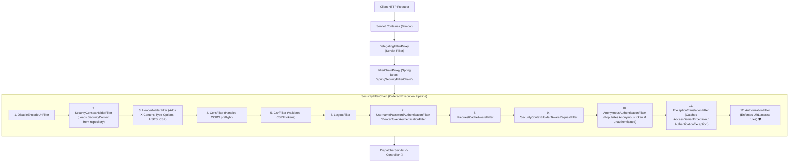

# 15-01: Spring Security 6: DelegatingFilterProxy & SecurityFilterChain Architecture

> **Module**: `MOD-15: Spring Security`
> **Topic ID**: `SB-15-01`
> **Prerequisites**: `SB-08-01`, `SB-08-05`
> **Primary Technology**: Java 21 LTS | Spring Security 6.4.2 | Security Filter Pipeline
> **Verification Date**: 2026-09-01

---

## 1. Problem
The Servlet Container (Tomcat) manages standard Servlet Filters, but security filters require dependency injection from the Spring `ApplicationContext` (e.g. database repositories, user details services, token decoders). How does Spring bridge the gap between Tomcat's lifecycle and Spring's bean container?

---

## 2. Why It Exists
Spring Security uses the **`DelegatingFilterProxy`** pattern:
1. **`DelegatingFilterProxy`**: Registered in the Servlet Container under the bean name `springSecurityFilterChain`. It delegates all `doFilter()` calls into the Spring IoC container.
2. **`FilterChainProxy`**: The central Spring bean holding a list of `SecurityFilterChain` instances.
3. **`SecurityFilterChain`**: An ordered collection of 15+ security filters evaluated against incoming request matchers.

---

## 3. Architecture: The Complete Security Filter Pipeline



---

## 4. Modern Component-Based Configuration in Spring Security 6
In Spring Security 6, `WebSecurityConfigurerAdapter` is completely removed. Configurations are defined as `@Bean` methods returning `SecurityFilterChain` with the **Lambda DSL**:

```java
package com.spring.interview.security.config;

import org.springframework.context.annotation.Bean;
import org.springframework.context.annotation.Configuration;
import org.springframework.security.config.Customizer;
import org.springframework.security.config.annotation.method.configuration.EnableMethodSecurity;
import org.springframework.security.config.annotation.web.builders.HttpSecurity;
import org.springframework.security.config.annotation.web.configuration.EnableWebSecurity;
import org.springframework.security.config.annotation.web.configurers.AbstractHttpConfigurer;
import org.springframework.security.config.http.SessionCreationPolicy;
import org.springframework.security.web.SecurityFilterChain;

@Configuration
@EnableWebSecurity
@EnableMethodSecurity
public class SecurityConfiguration {

    @Bean
    public SecurityFilterChain securityFilterChain(HttpSecurity http) throws Exception {
        return http
            .csrf(AbstractHttpConfigurer::disable)
            .cors(Customizer.withDefaults())
            .sessionManagement(session -> session.sessionCreationPolicy(SessionCreationPolicy.STATELESS))
            .authorizeHttpRequests(auth -> auth
                .requestMatchers("/api/public/**").permitAll()
                .requestMatchers("/api/admin/**").hasRole("ADMIN")
                .anyRequest().authenticated()
            )
            .httpBasic(Customizer.withDefaults())
            .build();
    }
}
```

---

## 5. Common Mistakes
- **Using deprecated `.and()` chaining**: Spring Security 6 deprecates `.and()` chaining in favor of type-safe lambda DSL (`http -> http.csrf(...)`).

---

## 6. Interview Questions
1. **SDE2**: What is the role of `DelegatingFilterProxy` and `FilterChainProxy`?
2. **Senior**: How does `ExceptionTranslationFilter` handle `AuthenticationException` vs `AccessDeniedException` differently?

---

## 7. Interview Answer (Senior Level)
"`DelegatingFilterProxy` is a standard Servlet filter registered in the container that delegates filter execution to `FilterChainProxy`, which is a Spring-managed bean. `FilterChainProxy` routes requests to the matching `SecurityFilterChain`. Inside the chain, `ExceptionTranslationFilter` sits directly before `AuthorizationFilter`. If downstream filters or controllers throw `AuthenticationException` (unauthenticated user), it initiates the `AuthenticationEntryPoint` (e.g. returns `401 Unauthorized` or redirects to login). If `AccessDeniedException` is thrown (authenticated user with insufficient roles), it delegates to `AccessDeniedHandler`, returning `403 Forbidden`."
