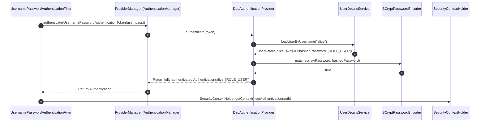

# 15-02: Authentication Architecture: AuthenticationManager, Providers & PasswordEncoders

> **Module**: `MOD-15: Spring Security`
> **Topic ID**: `SB-15-02`
> **Prerequisites**: `SB-15-01`
> **Primary Technology**: Java 21 LTS | Authentication Pipeline | Cryptographic Hashing
> **Verification Date**: 2026-09-01

---

## 1. Problem
How does Spring Security verify incoming credentials (username/password, API keys, certificates) across multiple heterogeneous backends (Database, LDAP, OAuth2) and securely store the authenticated identity in the JVM?

---

## 2. Why It Exists: Core Authentication Interfaces
1. **`Authentication`**: Encapsulates credentials, principal details, and granted authorities (`Collection<? extends GrantedAuthority>`).
2. **`AuthenticationManager`**: Primary entry point for authentication (`authenticate(Authentication auth)`).
3. **`ProviderManager`**: Default `AuthenticationManager` implementation iterating a list of `AuthenticationProvider`s.
4. **`AuthenticationProvider`**: Specialized authenticator (e.g. `DaoAuthenticationProvider`, `JwtAuthenticationProvider`).
5. **`PasswordEncoder`**: Cryptographic one-way hashing with salt (e.g. `BCryptPasswordEncoder`, `Argon2PasswordEncoder`).

---

## 3. Architecture: The Authentication Execution Flow



---

## 4. Production Password Hashing: BCrypt vs Plain Text
Never store plain text or simple MD5/SHA-256 hashes! Always use adaptive slow-hashing functions:

```java
@Bean
public PasswordEncoder passwordEncoder() {
    // BCrypt with cost factor 12 (work factor = 2^12 = 4096 rounds)
    return new BCryptPasswordEncoder(12);
}
```

---

## 5. Common Mistakes
- **Creating new `BCryptPasswordEncoder()` instances on every request**: Inject it as a Spring `@Bean` singleton.
- **Comparing password hashes with `String.equals()`**: Vulnerable to timing attacks! `PasswordEncoder.matches()` uses constant-time array comparison.

---

## 6. Interview Questions
1. **SDE2**: Walk me through the Spring Security authentication flow from the filter to `SecurityContextHolder`.
2. **Senior**: Why is MD5/SHA-256 unsuitable for password storage, and how does BCrypt protect against GPU brute-force attacks?

---

## 7. Interview Answer (Senior Level)
"When credentials arrive, an authentication filter wraps them in an unauthenticated `Authentication` token and passes it to `ProviderManager`. `ProviderManager` iterates its registered `AuthenticationProvider`s (like `DaoAuthenticationProvider`). The provider calls `UserDetailsService.loadUserByUsername()` to fetch stored credentials and invokes `PasswordEncoder.matches()` using constant-time comparison to prevent timing attacks. Upon success, it returns an authenticated token containing granted authorities, which is stored in `SecurityContextHolder`. Fast hashes like MD5/SHA-256 compute in nanoseconds, enabling GPUs to compute billions of guesses per second. BCrypt uses the Eksblowfish key schedule with an adjustable cost factor ($2^{\text{cost}}$ iterations) and auto-generated salts, making brute-force computation intentionally slow and memory-hard."
