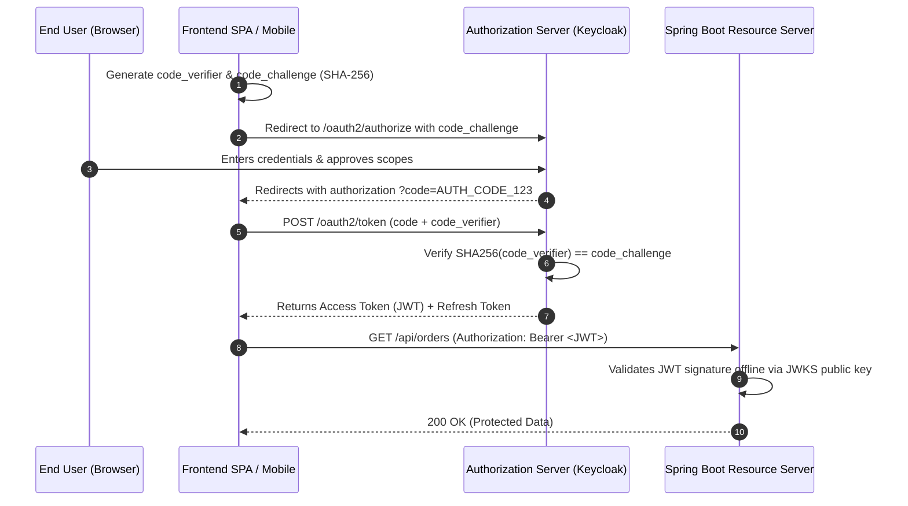

# 16-01: OAuth 2.0 & OIDC Architecture: The 4 Roles & Production Grant Types

> **Module**: `MOD-16: OAuth 2.0 & JWT`
> **Topic ID**: `SB-16-01`
> **Prerequisites**: `SB-15-01`
> **Primary Technology**: Java 21 LTS | OAuth 2.1 / OIDC Standards | Identity Architecture
> **Verification Date**: 2026-09-01

---

## 1. Problem
In distributed architectures, sharing user passwords directly with third-party web or mobile apps creates massive security vulnerabilities. How do you delegate authorization securely without exposing user credentials?

---

## 2. Why It Exists: The 4 Core OAuth 2.0 Roles
1. **Resource Owner**: The end user who owns the data.
2. **Client**: The application requesting access to the user's data (SPA, Mobile App, Backend Service).
3. **Authorization Server (IdP)**: Issues security tokens upon authenticating the Resource Owner (e.g. Keycloak, Auth0, Okta).
4. **Resource Server**: The Spring Boot backend API hosting protected resources and validating tokens.

---

## 3. Architecture: The 3 Production OAuth 2.0 / 2.1 Grant Types

```mermaid
flowchart TD
    G{"Choose OAuth Grant Type"}

    G -->|User interactive login via browser / mobile| G1["1. Authorization Code + PKCE (Proof Key for Code Exchange) 🏆 Industry Standard"]
    G -->|Machine-to-Machine (M2M) service communication| G2["2. Client Credentials Grant (Client ID + Client Secret -> Access Token)"]
    G -->|Expiring access tokens| G3["3. Refresh Token Grant (Exchanges long-lived refresh token for new access token)"]
```

---

## 4. Why Legacy Grant Types Were Deprecated in OAuth 2.1
- **Implicit Grant**: Deprecated because access tokens were returned directly in URL fragments (`#access_token=...`), vulnerable to browser history logging and referrer leakage. Replaced by **Authorization Code + PKCE**.
- **Resource Owner Password Credentials (ROPC)**: Deprecated because it encouraged clients to collect raw user passwords.

---

## 5. Architecture: Authorization Code Flow with PKCE Trace



---

## 6. Common Mistakes
- **Using Client Credentials for user logins**: Client Credentials represents the machine application itself, not an authenticated end user.

---

## 7. Interview Questions
1. **SDE2**: What are the 4 fundamental roles in OAuth 2.0?
2. **Senior**: How does PKCE (Proof Key for Code Exchange) prevent authorization code interception attacks in Single Page Applications?

---

## 8. Interview Answer (Senior Level)
"In public clients (SPAs and mobile apps), clients cannot securely store a `client_secret`. An attacker intercepting the authorization code via custom URI schemes or browser history could exchange it for tokens. PKCE solves this by having the client generate a cryptographically random `code_verifier` and its SHA-256 hash `code_challenge`. The client sends `code_challenge` in the authorization request. When exchanging the code at `/oauth2/token`, the client presents the raw `code_verifier`. The Authorization Server hashes it and ensures it matches the original challenge. Because the attacker does not possess the secret `code_verifier`, intercepted authorization codes cannot be redeemed."
