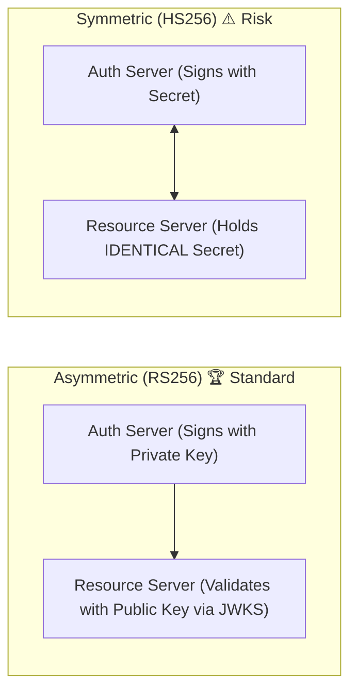

# 16-02: JWT Anatomy: Header, Claims, Asymmetric Signatures & JWKS

> **Module**: `MOD-16: OAuth 2.0 & JWT`
> **Topic ID**: `SB-16-02`
> **Prerequisites**: `SB-16-01`
> **Primary Technology**: Java 21 LTS | RFC 7519 JWT | Asymmetric Cryptography & JWKS
> **Verification Date**: 2026-09-01

---

## 1. Problem
How does a stateless microservice validate incoming client requests in nanoseconds without making expensive network calls back to the central Authorization Server on every single HTTP request?

---

## 2. Why It Exists: JSON Web Token (JWT) Structure
A JWT (RFC 7519) is a Base64URL-encoded string consisting of 3 dot-separated parts:
`Header.Payload.Signature`

```
eyJhbGciOiJSUzI1NiIsImtpZCI6ImF1dGgta2V5LTEifQ . eyJzdWIiOiJ1c3ItMTIzIiwicm9sZXMiOlsiQURNSU4iXX0 . dGhpcy1pcy1hLXJlYWwtc2lnbmF0dXJl
```

1. **Header (JOSE)**: Token type (`typ: "JWT"`), signing algorithm (`alg: "RS256"`), and Key ID (`kid: "auth-key-1"`).
2. **Payload (Registered & Custom Claims)**:
   - `sub`: Subject (User ID)
   - `iss`: Issuer URL (`https://auth.company.com/realms/prod`)
   - `aud`: Audience (`order-service-api`)
   - `exp`: Expiration Unix Timestamp
   - `iat`: Issued-At Unix Timestamp
   - Custom claims: `roles`, `email`, `tenant_id`
3. **Signature**: Cryptographic signature calculated as:
   $\text{Signature} = \text{Sign}_{\text{PrivateKey}}(\text{Base64Url}(\text{Header}) + "." + \text{Base64Url}(\text{Payload}))$

---

## 3. Symmetric (HMAC-SHA256) vs Asymmetric (RSA-RS256 / ECDSA-ES256)



- **Symmetric (HS256)**: Shared secret. If a single resource server is compromised, the attacker can forge valid tokens for all services.
- **Asymmetric (RS256 / ES256)**: Auth Server signs with a **Private Key**; Resource Servers validate offline using the **Public Key** fetched from `/.well-known/jwks.json`.

---

## 4. JSON Web Key Set (JWKS) & Key Rotation
The Resource Server periodically downloads public keys from the IdP:
```json
{
  "keys": [
    {
      "kty": "RSA",
      "kid": "auth-key-1",
      "use": "sig",
      "alg": "RS256",
      "n": "u1W...modulus...",
      "e": "AQAB"
    }
  ]
}
```
When an IdP rotates keys, it adds `auth-key-2` to JWKS. The Resource Server looks up the matching `kid` in the token's header to verify the signature without downtime.

---

## 5. Common Mistakes
- **Validating tokens without checking the `exp` (expiration) and `iss` (issuer) claims**: Vulnerable to replay and token spoofing attacks.

---

## 6. Interview Questions
1. **SDE2**: What are the 3 components of a JSON Web Token?
2. **Senior**: How does a Resource Server validate RS256 JWT tokens with zero network latency to the Authorization Server?

---

## 7. Interview Answer (Senior Level)
"An RS256 JWT consists of a Base64URL-encoded Header, Payload, and RSA Signature. During startup, the Resource Server downloads and caches public keys from the IdP's `/.well-known/jwks.json` endpoint. When an incoming request arrives, the Resource Server reads the `kid` (Key ID) and `alg` from the JWT header, retrieves the corresponding public RSA key from its in-memory JWKS cache, and verifies the signature mathematically. It then verifies temporal claims (`exp`, `nbf`) and the `iss` issuer string. Because cryptographic signature validation is purely in-memory CPU math, validation happens in sub-milliseconds with zero remote HTTP calls."
