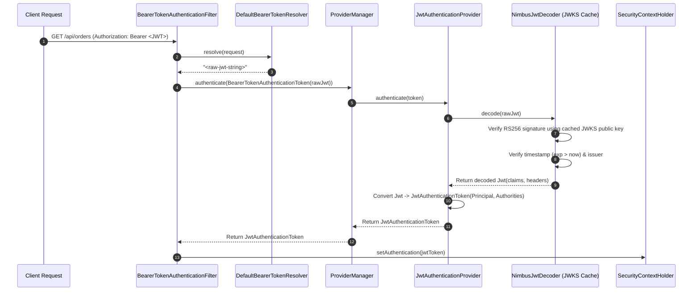

# 16-03: Spring Security Resource Server: Decoder, Validator & Filter Pipeline

> **Module**: `MOD-16: OAuth 2.0 & JWT`
> **Topic ID**: `SB-16-03`
> **Prerequisites**: `SB-15-01`, `SB-16-02`
> **Primary Technology**: Java 21 LTS | Resource Server | Nimbus JOSE Decoder
> **Verification Date**: 2026-09-01

---

## 1. Problem
How do you configure a Spring Boot application to automatically extract Bearer tokens from incoming HTTP `Authorization` headers, validate signatures against an IdP (e.g. Keycloak / Auth0), enforce timestamp/audience claims, and populate the `SecurityContext`?

---

## 2. Why It Exists
`spring-boot-starter-oauth2-resource-server` provides the **`BearerTokenAuthenticationFilter`** and the **`JwtDecoder`** interface implemented via Nimbus JOSE.

---

## 3. Architecture: The Resource Server Filter Lifecycle



---

## 4. Resource Server Configuration in `application.yml`
```yaml
spring:
  security:
    oauth2:
      resourceserver:
        jwt:
          issuer-uri: https://auth.company.com/realms/production
          jwk-set-uri: https://auth.company.com/realms/production/protocol/openid-connect/certs
```

---

## 5. Common Mistakes
- **Hardcoding asymmetric public keys in `application.yml`**: Prevents automated key rotation without application redeployment; always configure `jwk-set-uri`.

---

## 6. Interview Questions
1. **SDE2**: What filter in Spring Security extracts the Bearer token from the `Authorization` header?
2. **Senior**: How does `NimbusJwtDecoder` handle JWKS cache invalidation when the Authorization Server rotates its RSA signing keys?

---

## 7. Interview Answer (Senior Level)
"`BearerTokenAuthenticationFilter` extracts the Bearer token using `DefaultBearerTokenResolver`. It passes the unauthenticated token to `JwtAuthenticationProvider`, which delegates to `NimbusJwtDecoder`. `NimbusJwtDecoder` uses Nimbus JOSE's `RemoteJWKSet`, which maintains an in-memory cache of public keys fetched from `jwk-set-uri`. When a request arrives with a `kid` (Key ID) header not found in the local cache, Nimbus makes an on-demand refresh call to the JWKS endpoint to fetch newly rotated public keys, ensuring seamless key rotation without requiring application restarts."
