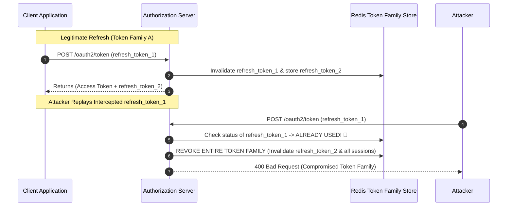

# 16-05: Token Revocation, Refresh Token Rotation & Security Hygiene

> **Module**: `MOD-16: OAuth 2.0 & JWT`
> **Topic ID**: `SB-16-05`
> **Prerequisites**: `SB-16-01`, `SB-16-02`
> **Primary Technology**: Java 21 LTS | Token Revocation | Distributed Blacklists & Refresh Rotation
> **Verification Date**: 2026-09-01

---

## 1. Problem
Because JWTs are stateless and self-contained, once issued, an access token remains valid until its expiration timestamp (`exp`). If a user's account is compromised or logged out, how can you immediately revoke access across 50 microservices without turning JWTs into stateful session bottlenecks?

---

## 2. Why It Exists: Production Revocation & Refresh Strategies
Senior backend architects employ a combination of three patterns:
1. **Short-Lived Access Tokens (5–15 minutes)**: Limits the vulnerability window of stolen tokens.
2. **Refresh Token Rotation with Reuse Detection**: Every time a refresh token is used, it is invalidated and replaced by a *new* refresh token. If an old refresh token is reused, the Auth Server immediately revokes the *entire* token family (indicating theft).
3. **Distributed Redis Revocation Blacklist / Bloom Filter**: Storing revoked `jti` (JWT ID) tokens in Redis with a TTL equal to the token's remaining lifetime.

---

## 3. Architecture: Refresh Token Rotation & Compromise Detection

---

## 4. Production Security Hygiene Checklist
- ✅ **Keep Access Tokens Short-Lived**: Max 15 minutes.
- ✅ **Enforce HTTPS / TLS 1.3**: Tokens in plain HTTP headers can be sniffed.
- ✅ **Use Asymmetric Cryptography (RS256 / ES256)**: Never share private signing keys with Resource Servers.
- ✅ **Store Refresh Tokens in `HttpOnly; Secure; SameSite=Strict` Cookies**: Protects against XSS extraction.
- ✅ **Validate Clock Skew**: Configure a small clock skew (e.g. 60 seconds) in `JwtDecoder` to accommodate minor server clock drift.

---

## 5. Common Mistakes
- **Setting 30-day expiration on JWT access tokens**: Makes token revocation impossible without a stateful distributed blacklist query on every single request.

---

## 6. Interview Questions
1. **SDE2**: How do you invalidate an access token when a user logs out in a stateless JWT architecture?
2. **Senior**: How does Refresh Token Rotation with automatic reuse detection protect against token theft?

---

## 7. Interview Answer (Senior Level)
"In stateless architectures, token revocation is handled hierarchically. First, access tokens are kept short-lived (e.g. 10 minutes), naturally bounding exposure. For instant revocation (e.g. logout or security incidents), the Resource Server checks incoming `jti` (JWT ID) claims against an in-memory or low-latency Redis Bloom Filter/blacklist cached with a TTL matching the token expiration. For long-lived sessions, we enforce Refresh Token Rotation: whenever a refresh token is exchanged, it is invalidated and replaced with a new one. If an attacker and legitimate user both present the same prior refresh token, the Authorization Server detects token reuse and invalidates the entire token lineage immediately, forcing re-authentication and neutralizing the breach."
