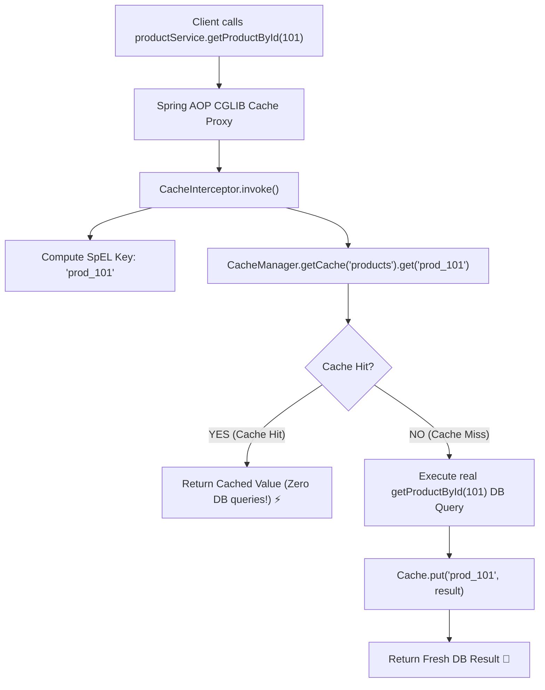

# 17-01: Spring Cache Abstraction & AOP Proxy Interception Internals

> **Module**: `MOD-17: Spring Cache & Redis`
> **Topic ID**: `SB-17-01`
> **Prerequisites**: `SB-04-01`, `SB-04-03`
> **Primary Technology**: Java 21 LTS | Spring Cache Abstraction | AOP Proxy Interceptors
> **Verification Date**: 2026-09-01

---

## 1. Problem
How does annotating a method with `@Cacheable("products")` intercept method execution, check if the computed key exists in cache, return cached results without executing the expensive database query, and put new return values into the cache?

---

## 2. Why It Exists: Core Spring Cache Interfaces
1. **`CacheManager`**: Factory SPI for creating and retrieving named `Cache` instances (e.g. `RedisCacheManager`, `CaffeineCacheManager`).
2. **`Cache`**: Low-level cache storage contract (`get(key)`, `put(key, value)`, `evict(key)`).
3. **`CacheInterceptor`**: The AOP MethodInterceptor executing caching logic.
4. **`KeyGenerator`**: Strategy for computing unique composite cache keys (`SimpleKeyGenerator`).

---

## 3. Architecture: The `@Cacheable` Proxy Interception Pipeline

---

## 4. The 4 Essential Spring Cache Annotations

| Annotation | Execution Phase | Description & Semantics |
|---|---|---|
| **`@Cacheable`** | **Before Method** | Looks up key; if found, returns cached value immediately. Otherwise executes method and caches result. |
| **`@CachePut`** | **After Method** | **Always executes method**; puts returned value into cache (for update mutations). |
| **`@CacheEvict`** | Before or After | Removes key (or entire cache via `allEntries=true`) from cache. |
| **`@Caching`** | Composed | Combines multiple cache operations (e.g. multi-evict + put). |

---

## 5. SpEL Expressions: `condition` vs `unless`
- **`condition = "#id > 0"`**: Evaluated **BEFORE** method execution. If false, caching is bypassed completely.
- **`unless = "#result == null"`**: Evaluated **AFTER** method execution. If true, the result is **NOT** cached (prevents caching null values).

---

## 6. Common Mistakes
- **Self-invocation trap**: Calling `@Cacheable` method from within the same class (`this.getProduct()`) bypasses the Spring AOP proxy, executing the method every time!

---

## 7. Interview Questions
1. **SDE2**: What is the difference between `@Cacheable` and `@CachePut`?
2. **Senior**: What is the difference between the `condition` and `unless` attributes in `@Cacheable`, and in what order are they evaluated?

---

## 8. Interview Answer (Senior Level)
"`@Cacheable` checks the cache first and short-circuits method execution on a hit, whereas `@CachePut` always executes the method and updates the cache with the new return value. `condition` is evaluated *before* method invocation using input arguments (`#param`); if false, caching is bypassed. `unless` is evaluated *after* method execution and has access to the returned object (`#result`); if true, the calculated return value is vetoed from being written into the cache (ideal for preventing caching of nulls or error states)."
