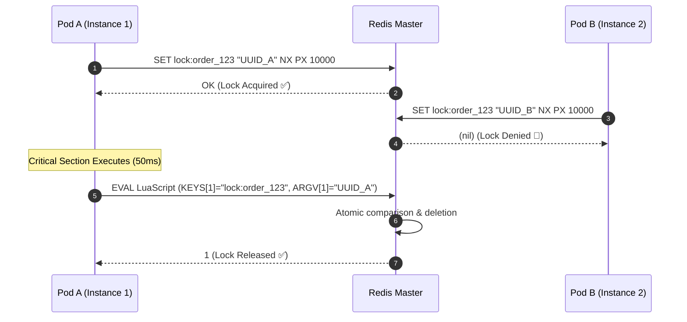

# 17-05: Distributed Locks with Redis: SETNX, Lua Atomic Release & Redlock

> **Module**: `MOD-17: Spring Cache & Redis`
> **Topic ID**: `SB-17-05`
> **Prerequisites**: `SB-17-01`, `SB-17-02`
> **Primary Technology**: Java 21 LTS | Distributed Concurrency | Redis Lua Scripting
> **Verification Date**: 2026-09-01

---

## 1. Problem
Standard Java `synchronized` blocks or `ReentrantLock` only synchronize threads within a single JVM process. When running 20 microservice pods in Kubernetes, how do you prevent race conditions (e.g. running a cron job once across the cluster or preventing duplicate payments) across multiple distributed instances?

---

## 2. Why It Exists: The Redis Distributed Mutex Contract
To implement a safe distributed lock in Redis:
1. **Acquire**: Atomic `SET lock_key unique_token NX PX 30000` (Set if Not Exists with 30s TTL).
2. **Hold**: Execute critical section within the lease time.
3. **Release**: Must ONLY release the lock if the value stored in Redis matches our `unique_token` (prevents Thread A from unlocking Thread B's lock if A's execution exceeded the TTL!).

---

## 3. Architecture: The Atomic Lock Release Lua Script

Because checking the token (`GET`) and deleting the key (`DEL`) involves two separate commands, network delays can cause a race condition. Redis guarantees single-threaded atomic execution via **Lua Scripts**:

```lua
if redis.call("get", KEYS[1]) == ARGV[1] then
    return redis.call("del", KEYS[1])
else
    return 0
end
```



---

## 4. Production Example in Java 21: Redis Distributed Lock
```java
package com.spring.interview.cache.lock;

import org.springframework.data.redis.core.StringRedisTemplate;
import org.springframework.data.redis.core.script.DefaultRedisScript;
import org.springframework.stereotype.Component;

import java.time.Duration;
import java.util.Collections;
import java.util.UUID;

@Component
public class RedisAtomicDistributedLock {

    private final StringRedisTemplate redisTemplate;

    private static final String UNLOCK_LUA_SCRIPT = """
        if redis.call('get', KEYS[1]) == ARGV[1] then
            return redis.call('del', KEYS[1])
        else
            return 0
        end
    """;

    private final DefaultRedisScript<Long> unlockScript;

    public RedisAtomicDistributedLock(StringRedisTemplate redisTemplate) {
        this.redisTemplate = redisTemplate;
        this.unlockScript = new DefaultRedisScript<>(UNLOCK_LUA_SCRIPT, Long.class);
    }

    public String acquireLock(String lockKey, Duration ttl) {
        String token = UUID.randomUUID().toString();
        Boolean acquired = redisTemplate.opsForValue()
            .setIfAbsent(lockKey, token, ttl);

        return Boolean.TRUE.equals(acquired) ? token : null;
    }

    public boolean releaseLock(String lockKey, String token) {
        if (token == null) return false;
        Long result = redisTemplate.execute(unlockScript, Collections.singletonList(lockKey), token);
        return result != null && result == 1L;
    }
}
```

---

## 5. Common Mistakes
- **Releasing locks using plain `redisTemplate.delete(key)`**: If Thread A experiences a long GC pause, its lock expires, and Thread B acquires the lock. Thread A wakes up and calls `delete()`, unintentionally deleting Thread B's lock!

---

## 6. Interview Questions
1. **SDE2**: Why must you pass a unique UUID token when acquiring a Redis distributed lock?
2. **Senior**: How does Redisson's "Watchdog" timer solve the distributed lock TTL expiration problem during long-running tasks?

---

## 7. Interview Answer (Senior Level)
"When acquiring a lock with `SETNX PX`, a unique random token (UUID) must be stored as the value so that during release, we verify that the current owner matches before deleting. Releasing requires an atomic Lua script that compares the stored value against our UUID before executing `DEL`, preventing a thread that woke up after its lease expired from accidentally deleting a lock acquired by another thread. For long-running operations where estimating TTL is difficult, Redisson provides a background **Watchdog** daemon: while the acquiring thread is still running the critical section, the watchdog automatically extends the lock's TTL every 10 seconds (lease renewal), and stops renewing only when the thread explicitly releases the lock or crashes."
