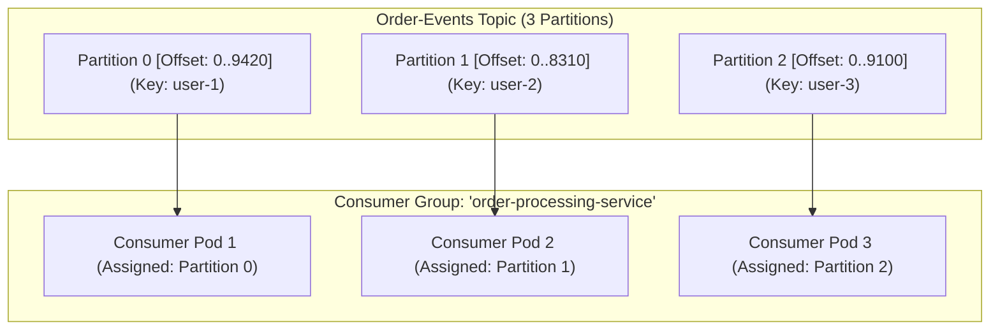

# 18-01: Apache Kafka Architecture: Partitions, Offsets & Consumer Groups

> **Module**: `MOD-18: Spring Kafka & Messaging`
> **Topic ID**: `SB-18-01`
> **Prerequisites**: Core Distributed Systems
> **Primary Technology**: Java 21 LTS | Apache Kafka 3.9 | Storage Log Architecture
> **Verification Date**: 2026-09-01

---

## 1. Problem
Traditional message brokers (RabbitMQ) push messages to consumers and delete messages once acknowledged. How does Apache Kafka achieve millions of writes per second, guarantee strict per-key ordering, and allow consumers to replay historical event streams from arbitrary points in time?

---

## 2. Why It Exists: Kafka Storage Log Architecture
Kafka is an append-only distributed commit log:
1. **Topic**: Logical category to which records are published.
2. **Partition**: The unit of parallelism, ordering, and replication. Each partition is an ordered, immutable sequence of records stored on disk as log segment files.
3. **Offset**: Sequential integer ID uniquely identifying each message within a partition.
4. **Consumer Group**: A group of cooperating consumer instances. Kafka guarantees that **each partition is assigned to exactly ONE consumer instance within a group**.

---

## 3. Architecture: Partition Distribution & Consumer Scalability

> [!NOTE]
> **Partition Rule**: If a Consumer Group has more consumer instances than partitions (e.g. 5 pods for 3 partitions), the 2 extra pods sit idle with zero partition assignments!

---

## 4. Consumer Offset Commit Strategies in Spring Kafka

| Strategy | Property / Container Setting | Trade-off & Behavior |
|---|---|---|
| **`BATCH`** *(Default)* | `AckMode.BATCH` | Commits offsets when all records returned by `poll()` are processed. |
| **`RECORD`** | `AckMode.RECORD` | Commits offset after *each individual record* is processed (Higher commit overhead). |
| **`MANUAL`** | `AckMode.MANUAL` | Requires explicit `Acknowledgment.acknowledge()` call in consumer code. |
| **`MANUAL_IMMEDIATE`** | `AckMode.MANUAL_IMMEDIATE` | Commits synchronously to broker immediately upon calling `acknowledge()`. |

---

## 5. Common Mistakes
- **Assuming Kafka guarantees total ordering across an entire topic**: Kafka **ONLY guarantees ordering within a single partition**. Messages with the same partition key (`murmur2(key) % numPartitions`) are guaranteed to land on the same partition and be consumed in exact order.

---

## 6. Interview Questions
1. **SDE2**: What happens if a consumer group has 6 consumer instances but the topic only has 4 partitions?
2. **Senior**: How does Kafka guarantee per-key message ordering, and what causes partition rebalancing in production?

---

## 7. Interview Answer (Senior Level)
"Kafka achieves per-key ordering by hashing the message key (`murmur2`) to deterministically route all events for that key to the same partition. Because each partition is assigned to exactly one consumer thread within a consumer group, records are consumed sequentially in FIFO order. If a group has 6 consumers for 4 partitions, 4 consumers read 1 partition each and 2 consumers remain idle. Partition rebalancing occurs when a consumer crashes, when heartbeats timeout (`max.poll.interval.ms` exceeded due to slow record processing), or when new pods join the group. Rebalancing halts consumption briefly while the Group Coordinator reassigns partitions across active members."
