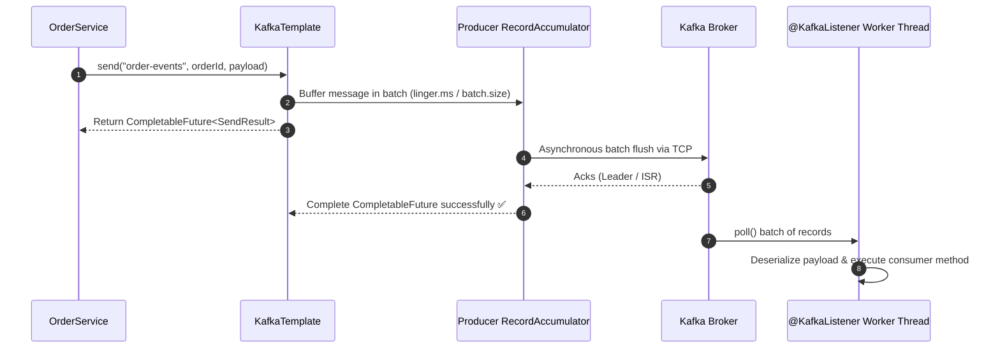

# 18-02: Spring Kafka Producers & Consumers: KafkaTemplate & @KafkaListener

> **Module**: `MOD-18: Spring Kafka & Messaging`
> **Topic ID**: `SB-18-02`
> **Prerequisites**: `SB-18-01`
> **Primary Technology**: Java 21 LTS | Spring for Apache Kafka 3.3.2 | Async Pipelines
> **Verification Date**: 2026-09-01

---

## 1. Problem
How does Spring Boot simplify publishing and consuming Kafka records while handling serialization, asynchronous `CompletableFuture` acknowledgment callbacks, batch polling, and multi-threaded consumer listeners?

---

## 2. Why It Exists: Core Spring Kafka Components
1. **`KafkaTemplate`**: High-level template wrapping `Producer<K, V>` providing asynchronous send methods returning `CompletableFuture<SendResult<K, V>>`.
2. **`@KafkaListener`**: Declarative method annotation for event consumption.
3. **`ConcurrentKafkaListenerContainerFactory`**: Factory creating multi-threaded `KafkaMessageListenerContainer` instances based on configured `concurrency`.

---

## 3. Architecture: Producer Batching & Consumer Polling Loop



---

## 4. Production Producer in Java 21 with Async Callback
```java
package com.spring.interview.kafka.producer;

import com.spring.interview.kafka.dto.OrderEventPayload;
import org.slf4j.Logger;
import org.slf4j.LoggerFactory;
import org.springframework.kafka.core.KafkaTemplate;
import org.springframework.kafka.support.SendResult;
import org.springframework.stereotype.Component;

import java.util.concurrent.CompletableFuture;

@Component
public class OrderEventProducer {

    private static final Logger log = LoggerFactory.getLogger(OrderEventProducer.class);
    private final KafkaTemplate<String, OrderEventPayload> kafkaTemplate;

    public OrderEventProducer(KafkaTemplate<String, OrderEventPayload> kafkaTemplate) {
        this.kafkaTemplate = kafkaTemplate;
    }

    public CompletableFuture<SendResult<String, OrderEventPayload>> sendOrderEvent(OrderEventPayload event) {
        CompletableFuture<SendResult<String, OrderEventPayload>> future =
            kafkaTemplate.send("order-events", event.orderId(), event);

        future.whenComplete((result, ex) -> {
            if (ex != null) {
                log.error("Failed to publish order event for id: {}", event.orderId(), ex);
            } else {
                log.info("Order event successfully sent to partition: {} with offset: {}",
                    result.getRecordMetadata().partition(),
                    result.getRecordMetadata().offset());
            }
        });

        return future;
    }
}
```

---

## 5. Production Consumer with Concurrency
```java
@KafkaListener(
    topics = "order-events",
    groupId = "inventory-service-group",
    concurrency = "3" // Spawns 3 dedicated consumer threads within the JVM
)
public void handleOrderEvent(
    @Payload OrderEventPayload event,
    @Header(KafkaHeaders.RECEIVED_PARTITION) int partition,
    @Header(KafkaHeaders.OFFSET) long offset
) {
    log.info("Processing order {} from partition {} at offset {}", event.orderId(), partition, offset);
}
```

---

## 6. Common Mistakes
- **Calling `.get()` on `KafkaTemplate.send()` in HTTP threads**: Blocks the web request thread waiting for Kafka network ACK, eliminating all asynchronous throughput benefits.

---

## 7. Interview Questions
1. **SDE2**: What does the `concurrency` property in `@KafkaListener` do?
2. **Senior**: How do `acks=all`, `min.insync.replicas=2`, and `enable.idempotence=true` guarantee zero message loss in Kafka producers?

---

## 8. Interview Answer (Senior Level)
"The `concurrency` attribute on `@KafkaListener` creates $N$ concurrent `KafkaMessageListenerContainer` threads inside the JVM process, allowing the application to consume from multiple partitions in parallel without spinning up separate application instances. For zero message loss, we configure: 1) `acks=all` (the broker only ACKs once all In-Sync Replicas have written to their commit log), 2) `min.insync.replicas=2` (rejects writes if fewer than 2 replicas are alive), and 3) `enable.idempotence=true` (assigns Producer IDs and sequence numbers to deduplicate retries on network transient failures)."
