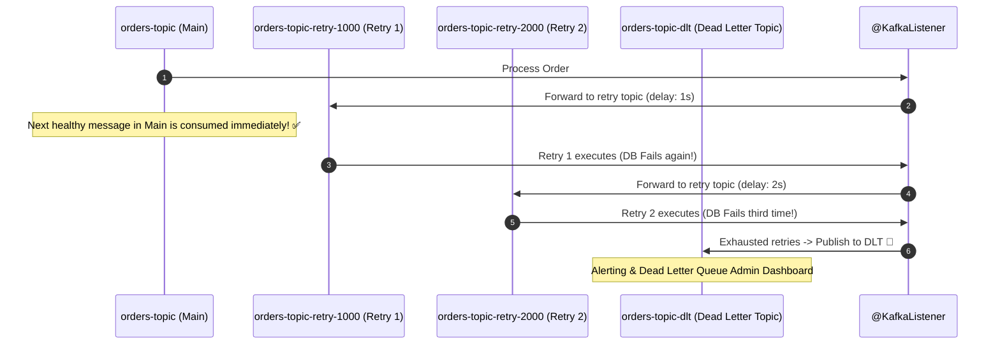

# 18-03: Kafka Error Handling: DefaultErrorHandler, @RetryableTopic & Dead Letter Topics

> **Module**: `MOD-18: Spring Kafka & Messaging`
> **Topic ID**: `SB-18-03`
> **Prerequisites**: `SB-18-01`, `SB-18-02`
> **Primary Technology**: Java 21 LTS | Error Handling & DLT | Non-Blocking Retries
> **Verification Date**: 2026-09-01

---

## 1. Problem
When a consumer encounters a temporary database outage or bad payload (poison pill), blocking the partition and retrying indefinitely freezes consumption of all subsequent healthy records on that partition, causing severe lag across the cluster.

---

## 2. Why It Exists: Blocking vs Non-Blocking Retries

```mermaid
flowchart TD
    E{"Consumer Encounter Exception"}

    E -->|1. Blocking Retry (DefaultErrorHandler)| B["Retries same record in-place N times with backoff. 🛑 STOPS all other records on that partition from being processed until succeeded or sent to DLT."]

    E -->|2. Non-Blocking Retry (@RetryableTopic) 🏆 Standard| NB["Publishes failed message to a retry topic ('orders-retry-10s') and ACKs current offset. Healthy records behind it continue processing instantly! 🚀"]
```

---

## 3. Architecture: Multi-Tier Non-Blocking Retry Pipeline with DLT



---

## 4. Production Example in Java 21: `@RetryableTopic` & `@DltHandler`
```java
package com.spring.interview.kafka.consumer;

import com.spring.interview.kafka.dto.OrderEventPayload;
import org.slf4j.Logger;
import org.slf4j.LoggerFactory;
import org.springframework.kafka.annotation.DltHandler;
import org.springframework.kafka.annotation.KafkaListener;
import org.springframework.kafka.annotation.RetryableTopic;
import org.springframework.kafka.retrytopic.TopicSuffixingStrategy;
import org.springframework.kafka.support.KafkaHeaders;
import org.springframework.messaging.handler.annotation.Header;
import org.springframework.messaging.handler.annotation.Payload;
import org.springframework.retry.annotation.Backoff;
import org.springframework.stereotype.Component;

@Component
public class OrderEventConsumer {

    private static final Logger log = LoggerFactory.getLogger(OrderEventConsumer.class);

    @RetryableTopic(
        attempts = "3",
        backoff = @Backoff(delay = 1000, multiplier = 2.0),
        topicSuffixingStrategy = TopicSuffixingStrategy.SUFFIX_WITH_INDEX_VALUE
    )
    @KafkaListener(topics = "order-events", groupId = "order-group")
    public void consumeOrderEvent(@Payload OrderEventPayload event) {
        log.info("Consuming order: {}", event.orderId());
        if ("FAIL_SIMULATION".equals(event.status())) {
            throw new RuntimeException("Simulated transient failure for order: " + event.orderId());
        }
    }

    @DltHandler
    public void handleDeadLetterRecord(
        @Payload OrderEventPayload payload,
        @Header(KafkaHeaders.ORIGINAL_TOPIC) String originalTopic,
        @Header(KafkaHeaders.EXCEPTION_MESSAGE) String errorMessage
    ) {
        log.error("DEAD LETTER RECORD: Order {} from topic {} failed permanently. Error: {}",
            payload.orderId(), originalTopic, errorMessage);
    }
}
```

---

## 5. Common Mistakes
- **Retrying fatal non-retryable exceptions (e.g. `DeserializationException` / `NullPointerException`)**: Configure `exclude = {IllegalArgumentException.class}` on `@RetryableTopic` so poison pills route straight to DLT without wasting CPU retries.

---

## 6. Interview Questions
1. **SDE2**: What is a Dead Letter Topic (DLT) in Kafka?
2. **Senior**: How does `@RetryableTopic` provide non-blocking retries without stalling head-of-line records on Kafka partitions?

---

## 7. Interview Answer (Senior Level)
"In standard in-place blocking retries (`DefaultErrorHandler`), the consumer thread sleeps and retries the failed message at the head of the partition, blocking all downstream healthy records from being consumed. Spring Kafka's `@RetryableTopic` solves this via non-blocking multi-topic routing: when a record fails, it is forwarded to a dedicated delayed retry topic (e.g. `orders-retry-1000`) and the offset on the main topic is committed. Main partition consumption continues uninterrupted at full speed. Separate listener containers subscribe to the retry topics with scheduled message backoffs, and if all retries are exhausted, the record is published to the terminal Dead Letter Topic (`orders-dlt`) where alerting and dead-letter replay tooling inspects it."
