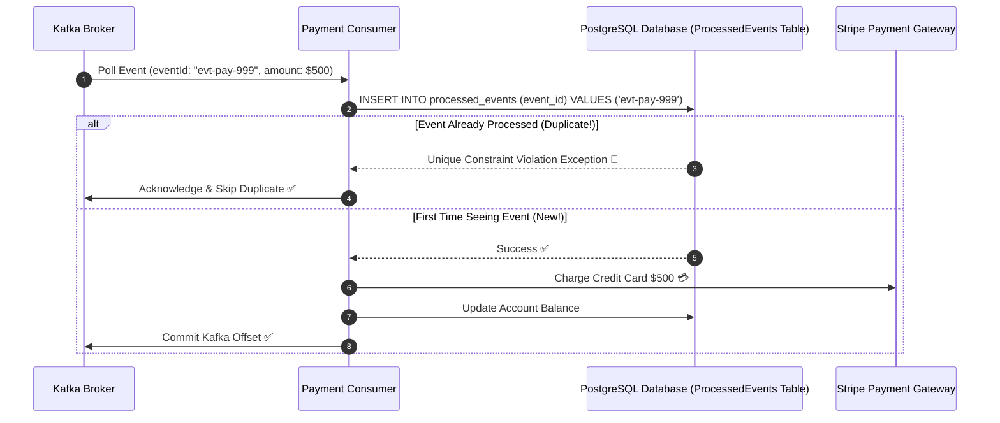

# 18-04: Idempotent Consumers, Deduplication & Exactly-Once Semantics (EOS)

> **Module**: `MOD-18: Spring Kafka & Messaging`
> **Topic ID**: `SB-18-04`
> **Prerequisites**: `SB-13-01`, `SB-18-01`
> **Primary Technology**: Java 21 LTS | Exactly-Once Semantics | Consumer Idempotence
> **Verification Date**: 2026-09-01

---

## 1. Problem
Kafka guarantees **At-Least-Once delivery** by default. If a consumer crashes right after processing a payment of \$500 but *before* committing its offset to the broker, upon restart the consumer will re-consume the payment message and charge the customer \$500 a second time!

---

## 2. Why It Exists: Producer Idempotence vs Consumer Idempotence
- **Producer Idempotence (`enable.idempotence=true`)**: Protects against duplicate writes between Producer and Broker caused by network retry timeouts. (Assigns PID and Monotonic Sequence Number).
- **Consumer Idempotence**: **The application's responsibility!** Protects against duplicate message processing between Broker and Consumer upon crash/rebalance.

---

## 3. Architecture: The Consumer Deduplication Store Pattern



---

## 4. Kafka Exactly-Once Semantics (EOS) in Spring Boot
When consuming from Topic A and producing to Topic B within the same stream:
```yaml
spring:
  kafka:
    producer:
      transaction-id-prefix: tx-order-
    consumer:
      isolation-level: read_committed
```
*Effect*: Spring Kafka wraps consumption, DB mutation, and outbound publishing into a single atomic transaction. Downstream consumers configured with `read_committed` will never see aborted messages.

---

## 5. Common Mistakes
- **Relying solely on Kafka producer idempotence to prevent consumer duplicates**: Producer idempotence only stops network duplicates between client and broker; consumer crash re-delivery still happens.

---

## 6. Interview Questions
1. **SDE2**: What is the difference between At-Least-Once, At-Most-Once, and Exactly-Once message delivery?
2. **Senior**: How do you architect a payments consumer to achieve 100% idempotent execution in a distributed microservice?

---

## 7. Interview Answer (Senior Level)
"In distributed systems, true network Exactly-Once is impossible without end-to-end coordination. At-Least-Once delivery delivers duplicates during consumer failure/rebalancing. We achieve end-to-end consumer idempotence by making operations inherently idempotent or using a **Deduplication Store / Unique Key Constraint Table**. Every event carries a globally unique `eventId` or `idempotencyKey`. Inside the consumer's database transaction, we execute `INSERT INTO processed_events (event_id, processed_at) VALUES (:id, now())`. If a duplicate arrives, the unique constraint fails, causing the transaction to abort and safely skip duplicate downstream effects like charging cards twice."
