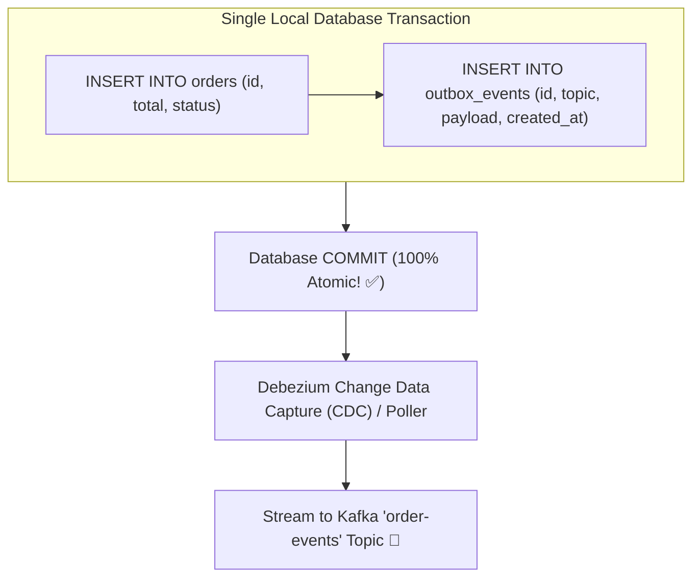
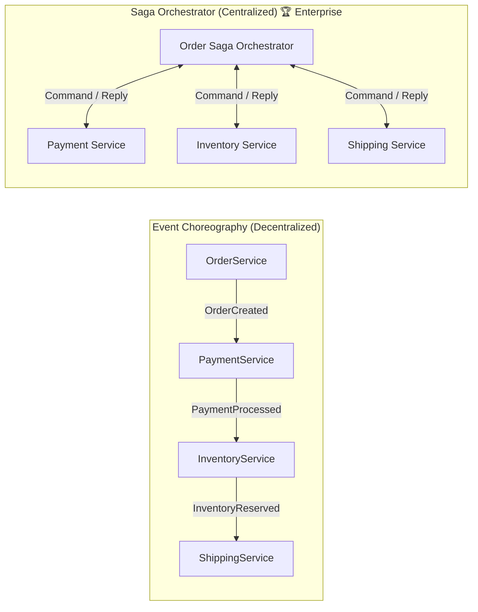

# 18-05: The Transactional Outbox Pattern & Event-Driven Sagas

> **Module**: `MOD-18: Spring Kafka & Messaging`
> **Topic ID**: `SB-18-05`
> **Prerequisites**: `SB-13-01`, `SB-18-02`
> **Primary Technology**: Java 21 LTS | Transactional Outbox | Event-Driven Architecture
> **Verification Date**: 2026-09-01

---

## 1. Problem: The Dual-Write Dilemma
A service creates an order in PostgreSQL and publishes an `OrderCreatedEvent` to Kafka.
- If it writes to DB first and Kafka publish fails $\rightarrow$ database has order, but no downstream events are sent!
- If it publishes to Kafka first and DB commit fails $\rightarrow$ downstream services process a phantom order that doesn't exist in the database!

---

## 2. Why It Exists: The Transactional Outbox Pattern
Instead of writing to two separate systems, the application writes both the **business entity** (`orders`) and the **outbox message** (`outbox_events`) into the **SAME local relational database transaction**:

---

## 3. Distributed Saga Patterns: Orchestration vs Choreography

| Dimension | Saga Choreography | Saga Orchestration |
|---|---|---|
| **Coordination** | Services publish events and listen directly to each other | Dedicated centralized coordinator sends commands |
| **Coupling** | Loosely coupled | Higher coupling to Orchestrator |
| **Cyclic Dependencies** | **High risk of spaghetti event dependency loops** | Zero cyclic loops |
| **Compensating Rollbacks** | Difficult to trace and coordinate across services | **Easy to orchestrate compensating transactions** |
| **Best For** | Simple 2–3 step workflows | Complex enterprise multi-step business transactions |

---

## 4. Compensating Transactions
When Step 3 of a Saga fails (e.g. inventory out of stock), the Saga Orchestrator triggers **Compensating Actions** backward to undo previous steps:
1. `RefundPaymentCommand` $\rightarrow$ refunds customer credit card.
2. `CancelOrderCommand` $\rightarrow$ marks order status as `FAILED`.

---

## 5. Common Mistakes
- **Assuming 2-Phase Commit (2PC / XA) is suitable for microservices**: XA transactions lock resources across services and do not scale; Sagas with eventual consistency and compensating actions are the industry standard.

---

## 6. Interview Questions
1. **SDE2**: What is the Dual-Write problem and how does the Transactional Outbox pattern solve it?
2. **Senior**: When should you use Saga Orchestration instead of Saga Choreography in high-scale banking/e-commerce workflows?

---

## 7. Interview Answer (Senior Level)
"The Dual-Write dilemma occurs because distributed transactions across disparate systems (relational DB and Kafka) cannot be atomically committed without blocking protocols like 2PC. The Transactional Outbox pattern resolves this by persisting outbound domain events into an `outbox_events` table inside the *same* local ACID database transaction as the business entity. A Change Data Capture (CDC) engine like Debezium tails the database write-ahead log (WAL) and publishes events to Kafka with zero dual-write race conditions. Saga Orchestration is preferred over Choreography for complex multi-step workflows because having a state machine coordinator makes the current workflow state explicit, avoids spaghetti event dependencies, and provides centralized management for triggering compensating rollback transactions if any step fails."
