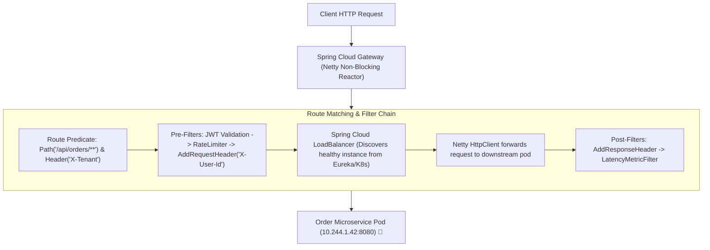

# 19-01: Microservices Topology: API Gateway, BFF & Service Discovery

> **Module**: `MOD-19: Spring Cloud & Microservices`
> **Topic ID**: `SB-19-01`
> **Prerequisites**: `SB-08-01`, `SB-15-01`
> **Primary Technology**: Java 21 LTS | Spring Cloud 2024.0.0 | Gateway & Discovery Architecture
> **Verification Date**: 2026-09-01

---

## 1. Problem
In a microservices architecture with 50+ backends, exposing internal service IPs directly to frontend mobile/web clients causes high client network chattyness, tight coupling to internal service schemas, and complex distributed authentication challenges.

---

## 2. Why It Exists: Core Architectural Patterns
1. **API Gateway (Spring Cloud Gateway)**: Single unified entrypoint built on **Project Reactor and Netty**. Handles cross-cutting concerns: routing, SSL termination, global rate limiting, and token verification.
2. **Backend For Frontend (BFF)**: Specialized gateways tailored to specific client types (e.g. Mobile BFF vs Web BFF).
3. **Service Discovery (Eureka / Consul / K8s DNS)**: Dynamic registry mapping logical service names (`ORDER-SERVICE`) to live ephemeral container IP/port instances.

---

## 3. Architecture: Spring Cloud Gateway Filter Pipeline



---

## 4. Modern Route Configuration in Java DSL
```java
@Bean
public RouteLocator customRouteLocator(RouteLocatorBuilder builder) {
    return builder.routes()
        .route("order-service-route", r -> r
            .path("/api/v1/orders/**")
            .filters(f -> f
                .addRequestHeader("X-Gateway-Forwarded", "true")
                .circuitBreaker(c -> c.setName("orderServiceCircuitBreaker").setFallbackUri("forward:/fallback/orders"))
                .requestRateLimiter(rl -> rl.setRateLimiter(redisRateLimiter()))
            )
            .uri("lb://ORDER-SERVICE")
        )
        .build();
}
```

---

## 5. Common Mistakes
- **Using blocking Servlet APIs in Spring Cloud Gateway**: Spring Cloud Gateway is reactive (Netty); blocking thread calls (`Thread.sleep()`, JDBC queries) will starve the Netty event loop and freeze the entire gateway!

---

## 6. Interview Questions
1. **SDE2**: What is the architectural difference between Spring Cloud Gateway (Netty) and legacy Netflix Zuul 1 (Servlet)?
2. **Senior**: When should you use Kubernetes-native DNS/Envoy service routing vs application-level Spring Cloud Gateway / Eureka?

---

## 7. Interview Answer (Senior Level)
"Legacy Zuul 1 operated on a blocking 1-thread-per-connection Servlet model, where slow downstream services starved thread pools and exhausted memory. Spring Cloud Gateway runs on Netty non-blocking event loops, handling tens of thousands of concurrent connections with a fixed thread pool equal to CPU cores. In modern Kubernetes environments, infrastructure concerns (TCP routing, TLS termination, pod IP DNS resolution) are handled natively by Kubernetes Services and Ingress/Envoy service meshes. Application-level Spring Cloud Gateway is used when business-aware routing is required: dynamic header enrichment from user JWT claims, fine-grained application SpEL predicates, or multi-tenant database routing."
