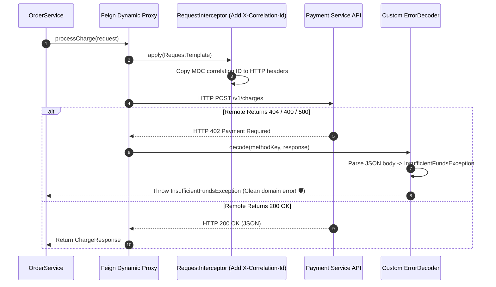

# 19-02: Declarative REST Clients: OpenFeign, Interceptors & Custom ErrorDecoder

> **Module**: `MOD-19: Spring Cloud & Microservices`
> **Topic ID**: `SB-19-02`
> **Prerequisites**: `SB-19-01`
> **Primary Technology**: Java 21 LTS | OpenFeign | Declarative HTTP Client
> **Verification Date**: 2026-09-01

---

## 1. Problem
Writing low-level `RestTemplate` or `RestClient` boilerplate across dozens of microservices requires manual URL building, header mapping, JSON deserialization, distributed trace header copying, and tedious HTTP error status code parsing.

---

## 2. Why It Exists: OpenFeign Declarative Contract
Spring Cloud OpenFeign generates dynamic reflection/bytecode proxies from Java interfaces annotated with standard Spring MVC annotations (`@GetMapping`, `@PathVariable`):

```java
@FeignClient(name = "payment-gateway", url = "${payment.service.url}")
public interface PaymentGatewayFeignClient {

    @PostMapping("/v1/charges")
    ChargeResponse processCharge(@RequestBody ChargeRequest request);
}
```

---

## 3. Architecture: Feign Request/Response Pipeline & Custom ErrorDecoder



---

## 4. Production Example in Java 21: Custom `ErrorDecoder`
```java
package com.spring.interview.cloud.decoder;

import feign.Response;
import feign.codec.ErrorDecoder;
import org.springframework.stereotype.Component;

@Component
public class CustomFeignErrorDecoder implements ErrorDecoder {

    public static class PaymentGatewayException extends RuntimeException {
        private final int statusCode;
        public PaymentGatewayException(int statusCode, String message) {
            super(message);
            this.statusCode = statusCode;
        }
        public int getStatusCode() { return statusCode; }
    }

    private final ErrorDecoder defaultDecoder = new Default();

    @Override
    public Exception decode(String methodKey, Response response) {
        if (response.status() == 400 || response.status() == 402) {
            return new PaymentGatewayException(response.status(), "Client payment rejected by remote gateway");
        }
        if (response.status() >= 500) {
            return new PaymentGatewayException(response.status(), "Remote payment gateway server error");
        }
        return defaultDecoder.decode(methodKey, response);
    }
}
```

---

## 5. Production `RequestInterceptor` for Correlation IDs
```java
package com.spring.interview.cloud.interceptor;

import feign.RequestInterceptor;
import feign.RequestTemplate;
import org.slf4j.MDC;
import org.springframework.stereotype.Component;

@Component
public class FeignCorrelationIdInterceptor implements RequestInterceptor {

    public static final String CORRELATION_HEADER = "X-Correlation-Id";

    @Override
    public void apply(RequestTemplate template) {
        String correlationId = MDC.get("correlationId");
        if (correlationId != null) {
            template.header(CORRELATION_HEADER, correlationId);
        }
    }
}
```

---

## 6. Common Mistakes
- **Letting raw `FeignException` leak to REST controllers**: Always implement `ErrorDecoder` to convert HTTP transport errors into strongly-typed domain exceptions.

---

## 7. Interview Questions
1. **SDE2**: What is the purpose of OpenFeign's `RequestInterceptor`?
2. **Senior**: How does `ErrorDecoder` prevent leaking remote downstream HTTP error structures into your local domain layer?

---

## 8. Interview Answer (Senior Level)
"OpenFeign creates a dynamic proxy around interface definitions. By default, HTTP 4xx/5xx responses throw generic `FeignException` containing raw HTTP payloads, which couples the calling service to downstream transport formats. By implementing a custom `ErrorDecoder`, we intercept non-2xx responses, inspect the HTTP status code and error payload, and translate them directly into explicit domain exceptions (e.g. `PaymentDeclinedException`, `ResourceNotFoundException`). Furthermore, `RequestInterceptor` allows us to inject authentication bearer tokens and distributed tracing identifiers (`X-Correlation-Id` from SLF4J MDC) onto all outbound calls transparently."
