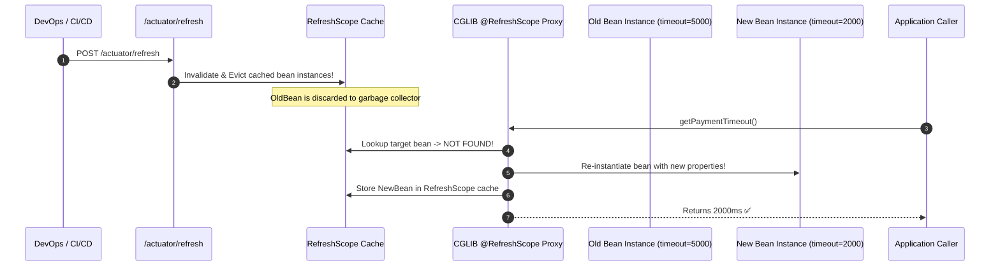

# 19-04: Distributed Configuration & @RefreshScope Internal Mechanics

> **Module**: `MOD-19: Spring Cloud & Microservices`
> **Topic ID**: `SB-19-04`
> **Prerequisites**: `SB-07-01`, `SB-19-01`
> **Primary Technology**: Java 21 LTS | Distributed Configuration | Dynamic Bean Reloading
> **Verification Date**: 2026-09-01

---

## 1. Problem
Updating a feature flag, payment timeout threshold, or rate limit in production shouldn't require rebuilding container images or restarting 100 running application pods.

---

## 2. Why It Exists: Spring Cloud Config & `@RefreshScope`
Spring Cloud Config centralizes configuration across environments (backed by Git, Vault, or JDBC). To reload bean properties dynamically without restarting the JVM, Spring Cloud provides **`@RefreshScope`**.

---

## 3. Architecture: How `@RefreshScope` Works Under the Hood

Standard Spring singleton beans are instantiated once during startup and never destroyed.
When a bean is annotated with `@RefreshScope`:
1. Spring generates a **CGLIB Dynamic Proxy** wrapping the target bean.
2. The proxy delegates method invocations to an underlying target instance stored in a internal cache (`GenericScope.BeanLifecycleDecorator`).
3. When `/actuator/refresh` or a Spring Cloud Bus Kafka event triggers a refresh:
   - `ContextRefresher` updates the `Environment` property sources.
   - Publishes `RefreshScopeRefreshedEvent`.
   - **Invalidates the internal target bean cache in `RefreshScope`!**
4. On the next method call to the bean, the CGLIB proxy discovers the cached target instance is missing, **re-instantiates a new target bean from scratch**, injects the newly updated properties, and caches it!



---

## 4. Production Example in Java 21: `@RefreshScope` Feature Flag
```java
package com.spring.interview.cloud.config;

import org.springframework.boot.context.properties.ConfigurationProperties;
import org.springframework.cloud.context.config.annotation.RefreshScope;
import org.springframework.stereotype.Component;

@Component
@RefreshScope
@ConfigurationProperties(prefix = "app.feature-flags")
public class DynamicFeatureProperties {

    private boolean newCheckoutFlowEnabled;
    private int maxConcurrentOrders = 50;

    public boolean isNewCheckoutFlowEnabled() { return newCheckoutFlowEnabled; }
    public void setNewCheckoutFlowEnabled(boolean enabled) { this.newCheckoutFlowEnabled = enabled; }
    public int getMaxConcurrentOrders() { return maxConcurrentOrders; }
    public void setMaxConcurrentOrders(int max) { this.maxConcurrentOrders = max; }
}
```

---

## 5. Common Mistakes
- **Annotating `@Configuration` classes with `@RefreshScope`**: Causes entire configuration trees and dependencies to be re-evaluated; annotate only the specific consumer service or `@ConfigurationProperties` bean.

---

## 6. Interview Questions
1. **SDE2**: What happens when an HTTP POST request is sent to `/actuator/refresh`?
2. **Senior**: Walk me through the internal CGLIB proxy mechanics of `@RefreshScope` during bean reloading.

---

## 7. Interview Answer (Senior Level)
"When `/actuator/refresh` is invoked, `ContextRefresher` fetches new properties from the Config Server, updates Spring's `StandardEnvironment`, and publishes a `RefreshScopeRefreshedEvent`. The `RefreshScope` listener responds by clearing its internal `Map<String, Object>` target bean cache. `@RefreshScope` beans are wrapped in CGLIB proxies during container initialization. When client code calls a proxy method post-refresh, the proxy intercepts the call, notices the target instance is no longer in `RefreshScope`'s cache, re-instantiates the bean via `BeanFactory.getBean()`, binds the newly updated properties, and caches the fresh instance. All of this happens lazily and transparently without restarting the JVM."
