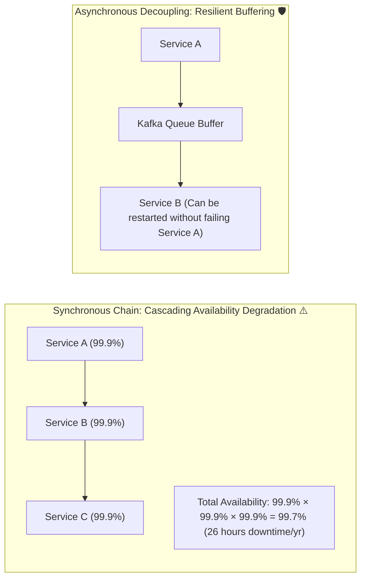

# 19-05: Sync vs Async Communication: REST/gRPC vs Event-Driven Messaging

> **Module**: `MOD-19: Spring Cloud & Microservices`
> **Topic ID**: `SB-19-05`
> **Prerequisites**: `SB-18-01`, `SB-19-01`
> **Primary Technology**: Java 21 LTS | Distributed Architecture | Communication Patterns
> **Verification Date**: 2026-09-01

---

## 1. Problem
Choosing between synchronous RPC (REST, OpenFeign, gRPC) and asynchronous event-driven messaging (Kafka, RabbitMQ) has profound implications on latency, availability, temporal coupling, and system complexity.

---

## 2. Comprehensive Architectural Comparison Matrix

| Dimension | Synchronous (REST / gRPC / Feign) | Asynchronous (Kafka / RabbitMQ) |
|---|:---:|:---:|
| **Coupling** | **Temporal Coupling** (Both services must be online simultaneously) | **Temporally Decoupled** (Sender succeeds even if receiver is down) |
| **Latency** | Immediate response (5–50ms) | Asynchronous / Eventual (50ms–several seconds) |
| **Availability Dependency** | $A_{\text{total}} = A_1 \times A_2 \times A_3$ (Multiplicative cascade) | Isolated (Service outage buffered in broker queue) |
| **Backpressure** | None (Slow receiver leads to 503 / 504 timeouts) | **Built-in** (Consumer pulls at its own sustainable rate) |
| **Query vs Command** | **Optimal for Read Queries** (`GET /users/123`) | **Optimal for Commands & State Events** (`OrderPlaced`) |
| **Protocol** | HTTP/1.1, HTTP/2 (Protobuf gRPC) | Binary TCP stream / AMQP |

---

## 3. Architecture: Availability Math in Sync Chains vs Async Decoupling

---

## 4. Architectural Decision Framework
- **Use Synchronous (REST/gRPC)**: When the client strictly requires an immediate query response to continue (e.g. validating user authentication, calculating live tax rates during checkout).
- **Use Asynchronous (Kafka/RabbitMQ)**: When initiating a state-changing side effect (e.g. processing payments, sending confirmation emails, updating search indexes, executing fraud checks).

---

## 5. Common Mistakes
- **Building long synchronous HTTP call chains (A $\rightarrow$ B $\rightarrow$ C $\rightarrow$ D $\rightarrow$ E)**: If service E has 200ms latency, the entire chain suffers compounding latency and any single failure drops the top-level user request.

---

## 6. Interview Questions
1. **SDE2**: What is temporal coupling in microservices?
2. **Senior**: How do you refactor a brittle 4-tier synchronous HTTP checkout pipeline into a resilient event-driven architecture?

---

## 7. Interview Answer (Senior Level)
"Temporal coupling means the caller and callee must both be actively available and responsive at the exact instant of communication. If a synchronous call chain spans 4 microservices, an outage in the leaf service cascades upstream, causing thread pool exhaustion and total request failure. To refactor a brittle checkout pipeline, we extract immediate validations (card authentication, inventory check) into a lean synchronous step, write the order and outbound event into a single atomic Transactional Outbox, and immediately return an `HTTP 202 Accepted` with an `orderId`. Downstream tasks (loyalty point accrual, invoice generation, email notifications, warehouse dispatch) are decoupled across independent asynchronous Kafka consumers, boosting overall system availability to 99.99%."
