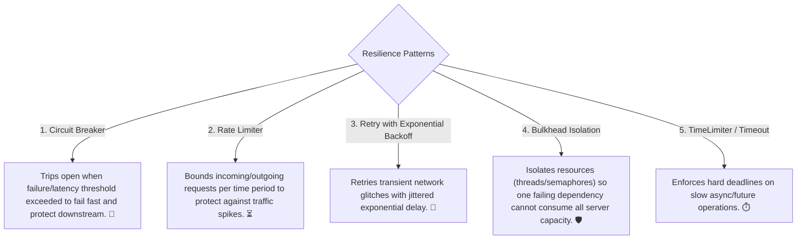

# 20-01: Enterprise Resilience Patterns: Circuit Breaker, Rate Limiter, Retry & Bulkhead

> **Module**: `MOD-20: Resilience & Fault Tolerance`
> **Topic ID**: `SB-20-01`
> **Prerequisites**: `SB-04-01`, `SB-19-05`
> **Primary Technology**: Java 21 LTS | Resilience4j 2.2.0 | Fault-Tolerant Architecture
> **Verification Date**: 2026-09-01

---

## 1. Problem
In distributed microservice networks, downstream third-party service outages or slow response times cascade upstream, consuming container thread pools and causing total system blackout (Cascading Failures).

---

## 2. Why It Exists: The 5 Core Resilience Patterns



---

## 3. Resilience Decorator Ordering Contract
When composing multiple resilience annotations on a single method, Resilience4j executes aspects in a strictly defined order:

```
Retry (Outer) ➔ CircuitBreaker ➔ RateLimiter ➔ TimeLimiter ➔ Bulkhead (Inner) ➔ Target Method
```
*Why this order matters*:
- **Retry wraps CircuitBreaker**: Retries on transient errors; if failures persist, the CircuitBreaker records them and trips open.
- **Bulkhead is innermost**: Ensures a thread is acquired only after rate limits and circuit breaker checks pass.

---

## 4. Production Resilience4j Configuration in `application.yml`
```yaml
resilience4j:
  circuitbreaker:
    instances:
      paymentService:
        slidingWindowType: COUNT_BASED
        slidingWindowSize: 10
        failureRateThreshold: 50.0
        slowCallRateThreshold: 70.0
        slowCallDurationThreshold: 2000ms
        waitDurationInOpenState: 10000ms
        permittedNumberOfCallsInHalfOpenState: 3
  retry:
    instances:
      paymentService:
        maxAttempts: 3
        waitDuration: 500ms
        enableExponentialBackoff: true
        exponentialBackoffMultiplier: 2.0
```

---

## 5. Common Mistakes
- **Retrying non-transient 4xx client errors (e.g. 400 Bad Request / 401 Unauthorized)**: Wastes server CPU and exhausts retry budgets; configure `ignoreExceptions` for validation errors.

---

## 6. Interview Questions
1. **SDE2**: What is the purpose of a Circuit Breaker in microservices?
2. **Senior**: What is the default aspect execution order when combining `@Retry`, `@CircuitBreaker`, and `@RateLimiter` on a single method?

---

## 7. Interview Answer (Senior Level)
"A Circuit Breaker monitors downstream call health and transitions from CLOSED to OPEN when the failure rate or slow call rate exceeds a threshold (e.g. 50%), failing fast immediately without making network calls to allow the remote dependency to recover. When combining annotations, Resilience4j enforces the execution order: **Retry $\rightarrow$ CircuitBreaker $\rightarrow$ RateLimiter $\rightarrow$ TimeLimiter $\rightarrow$ Bulkhead**. The Retry aspect is outermost so that transient failures are retried; if the Circuit Breaker trips OPEN, subsequent retry attempts fail fast immediately via `CallNotPermittedException`."
