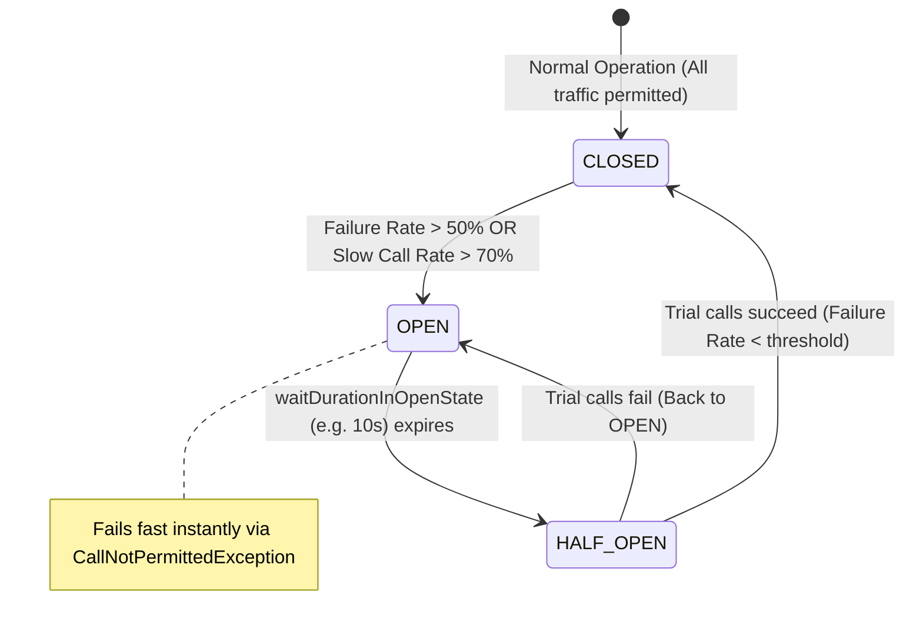

# 20-02: Resilience4j CircuitBreaker: Ring Bit Buffers & Sliding Window Math

> **Module**: `MOD-20: Resilience & Fault Tolerance`
> **Topic ID**: `SB-20-02`
> **Prerequisites**: `SB-20-01`
> **Primary Technology**: Java 21 LTS | Resilience4j 2.2.0 | Sliding Window State Machines
> **Verification Date**: 2026-09-01

---

## 1. Problem
Legacy circuit breakers (Netflix Hystrix) tracked metrics in 1-second statistical buckets with high memory overhead and GC pressure. How does Resilience4j achieve microsecond sliding window calculations with near-zero garbage collection?

---

## 2. Why It Exists: The Ring Bit Buffer
Resilience4j stores outcomes in a **Ring Bit Buffer**:
- `0` bit = Successful call.
- `1` bit = Failed call.
A sliding window of size 100 uses a tiny 128-bit array (2 `long` integers) in memory! Updating outcomes involves bitwise bit-shifting operations ($O(1)$ CPU math with zero heap allocation).

---

## 3. Architecture: The 3 Circuit Breaker States & Transitions

---

## 4. Sliding Window Types: `COUNT_BASED` vs `TIME_BASED`

| Dimension | `COUNT_BASED` | `TIME_BASED` |
|---|:---:|:---:|
| **Window Metric** | Last $N$ calls (e.g. 100 calls) | Last $T$ seconds (e.g. 60 seconds) |
| **Storage Structure** | Circular Bit Array / Ring Buffer | Epoch second circular arrays |
| **Low-Traffic Behavior** | Evaluates strictly when minimum calls recorded | Evaluates within time window |
| **Memory Footprint** | Extremely minimal ($O(1)$ bits) | Very low ($O(T)$ bucket array) |
| **Best For** | High-throughput APIs | Variable bursty traffic |

---

## 5. Minimum Number of Calls Protection
Before computing failure rates, Resilience4j requires `minimumNumberOfCalls` (e.g. 10):
- If 2 out of 2 calls fail (100% failure rate), the circuit **does NOT trip** because minimum call threshold (10) hasn't been met yet, preventing premature trips during service boot.

---

## 6. Common Mistakes
- **Setting `minimumNumberOfCalls` too low (e.g. 1 or 2)**: Causes single isolated network hiccups to trip the entire circuit.

---

## 7. Interview Questions
1. **SDE2**: What are the 3 states of a Circuit Breaker?
2. **Senior**: How does Resilience4j calculate failure rates using Ring Bit Buffers with zero garbage collection?

---

## 8. Interview Answer (Senior Level)
"A Circuit Breaker operates in three states: **CLOSED** (traffic flows normally), **OPEN** (trips after threshold violations, failing fast with `CallNotPermittedException`), and **HALF_OPEN** (after a wait duration, lets a trial batch of requests test if the downstream service has recovered). Resilience4j uses a `COUNT_BASED` Ring Bit Buffer implemented as primitive `long[]` bit arrays (0 for success, 1 for failure). When a call completes, a bit-shift operation updates the ring index. Computing the failure rate is simply counting the set bits via `Long.bitCount()` and dividing by window size. This eliminates object allocations, creating virtually zero GC pressure under 100k+ req/sec."
