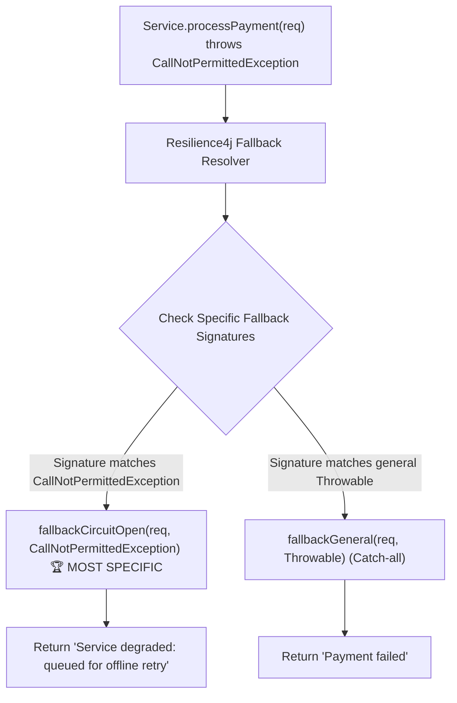

# 20-03: Resilience Fallback Contracts: Method Signatures & Cascading Degradation

> **Module**: `MOD-20: Resilience & Fault Tolerance`
> **Topic ID**: `SB-20-03`
> **Prerequisites**: `SB-20-01`, `SB-20-02`
> **Primary Technology**: Java 21 LTS | Resilience4j 2.2.0 | Graceful Degradation
> **Verification Date**: 2026-09-01

---

## 1. Problem
When a remote dependency fails or trips a circuit breaker, how do you provide graceful degradation (e.g. returning cached product recommendations or defaulting to offline billing mode) without crashing with runtime reflection method signature errors?

---

## 2. Why It Exists: The Fallback Method Contract
In Resilience4j:
1. The **fallback method must reside in the same class** (or be declared in a fallback factory).
2. The **fallback method must have the EXACT SAME parameter list** as the original method, plus an **additional trailing `Throwable` parameter**.
3. The **fallback method return type must match** the original method return type.

---

## 3. Architecture: Fallback Exception Matching



---

## 4. Production Example in Java 21
```java
package com.spring.interview.resilience.service;

import io.github.resilience4j.circuitbreaker.CallNotPermittedException;
import io.github.resilience4j.circuitbreaker.annotation.CircuitBreaker;
import io.github.resilience4j.ratelimiter.RequestNotPermitted;
import io.github.resilience4j.ratelimiter.annotation.RateLimiter;
import io.github.resilience4j.retry.annotation.Retry;
import org.slf4j.Logger;
import org.slf4j.LoggerFactory;
import org.springframework.stereotype.Service;

@Service
public class ExternalPaymentResilienceService {

    private static final Logger log = LoggerFactory.getLogger(ExternalPaymentResilienceService.class);

    public record PaymentResult(String transactionId, String status, String note) {}

    @CircuitBreaker(name = "paymentService", fallbackMethod = "paymentFallback")
    @RateLimiter(name = "paymentService", fallbackMethod = "rateLimitFallback")
    @Retry(name = "paymentService")
    public PaymentResult processPayment(String accountId, double amount) {
        if ("BAD_REMOTE".equals(accountId)) {
            throw new RuntimeException("Simulated remote 500 error on gateway");
        }
        return new PaymentResult("TX-" + System.currentTimeMillis(), "SUCCESS", "Processed via primary gateway");
    }

    // Specific fallback for Rate Limiting rejection
    public PaymentResult rateLimitFallback(String accountId, double amount, RequestNotPermitted ex) {
        log.warn("Rate limit exceeded for account {}: {}", accountId, ex.getMessage());
        return new PaymentResult("REJECTED", "RATE_LIMITED", "Too many requests; please retry in 1 second");
    }

    // General fallback when Circuit Breaker is OPEN or retries are exhausted
    public PaymentResult paymentFallback(String accountId, double amount, Throwable ex) {
        log.warn("Payment fallback activated for account {}. Cause: {}", accountId, ex.getMessage());
        return new PaymentResult("FALLBACK-" + accountId, "QUEUED_OFFLINE", "Queued for asynchronous offline settlement");
    }
}
```

---

## 5. Common Mistakes
- **Omitting the trailing `Throwable` argument in the fallback method signature**: Throws `NoSuchMethodException` at runtime!

---

## 6. Interview Questions
1. **SDE2**: What are the strict rules for defining a fallback method in Resilience4j?
2. **Senior**: How does exception hierarchy matching work when multiple fallback methods exist in the same class?

---

## 7. Interview Answer (Senior Level)
"In Resilience4j, fallback methods must match the exact parameter types and return type of the annotated target method, ending with an additional trailing parameter assignable from `Throwable`. When an exception is thrown, Resilience4j searches for the most specific exception match in the class: for example, if `CallNotPermittedException` is thrown, a fallback accepting `(args..., CallNotPermittedException)` will be selected over a catch-all fallback accepting `(args..., Throwable)`. If no matching method signature is found, Resilience4j throws `NoSuchMethodException`, preventing silent swallowing of errors."
