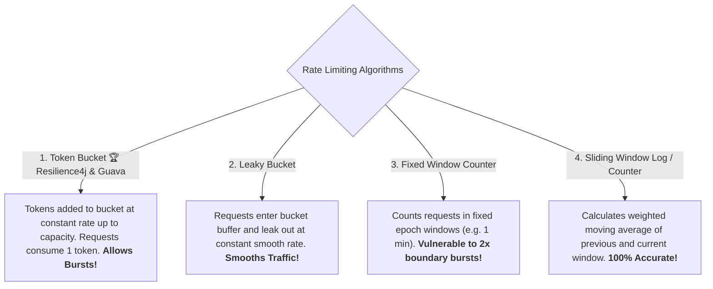

# 20-04: Rate Limiting Algorithms: Token Bucket, Leaky Bucket & Sliding Log

> **Module**: `MOD-20: Resilience & Fault Tolerance`
> **Topic ID**: `SB-20-04`
> **Prerequisites**: `SB-17-02`, `SB-20-01`
> **Primary Technology**: Java 21 LTS | Rate Limiting Algorithms | Traffic Shaping
> **Verification Date**: 2026-09-01

---

## 1. Problem
Uncontrolled client traffic spikes or rogue scripts can saturate CPU resources, exhaust database connections, and degrade service quality for all other tenants.

---

## 2. The 4 Rate Limiting Algorithms Compared



---

## 3. Detailed Algorithmic Comparison

| Algorithm | Allows Bursts? | Traffic Smoothing | Memory Usage | Implementation in Spring |
|---|:---:|:---:|:---:|---|
| **Token Bucket** | **YES (Up to bucket capacity)** | Moderate | Low ($O(1)$) | **Resilience4j `@RateLimiter`** / Bucket4j |
| **Leaky Bucket** | NO (Fixed outbound rate) | **High (Constant flow)** | Moderate (Queue buffer) | Netty traffic shaping |
| **Fixed Window** | **YES (2x burst at boundaries)** | Low | **Ultra-Low ($O(1)$ integer)** | Redis `INCR` + `EXPIRE` |
| **Sliding Window Counter** | NO | High | Low | Redis Lua scripts / Spring Cloud Gateway |

---

## 4. Resilience4j Rate Limiter Configuration
```yaml
resilience4j:
  ratelimiter:
    instances:
      paymentService:
        limitForPeriod: 10          # 10 requests allowed per refresh period
        limitRefreshPeriod: 1s      # Refreshes every 1 second
        timeoutDuration: 50ms       # Max wait time for token before rejecting
```

---

## 5. Common Mistakes
- **Using Fixed Window Counter on high-traffic APIs**: An attacker can send 100 requests at 11:59:59 and another 100 at 12:00:00, sending 200 requests within 1 second and bypassing a 100 req/min limit.

---

## 6. Interview Questions
1. **SDE2**: How does the Token Bucket algorithm differ from the Leaky Bucket algorithm?
2. **Senior**: Why does the Fixed Window Counter algorithm suffer from boundary burst vulnerabilities, and how does Sliding Window Counter fix it?

---

## 7. Interview Answer (Senior Level)
"Token Bucket adds tokens to a bucket at a fixed rate; requests consume tokens and proceed immediately, permitting short bursts up to the maximum bucket capacity. Leaky Bucket queues requests and processes them at a strictly constant rate, flattening all bursts into a smooth stream. Fixed Window Counter resets counts at fixed time intervals (e.g. minute boundaries), creating a boundary vulnerability where an attacker sends the full quota in the last second of window 1 and another quota in the first second of window 2 (delivering 2x the allowed rate in 2 seconds). Sliding Window Counter fixes this by calculating a weighted sum of the previous window and the elapsed portion of the current window, smoothing boundary transitions with minimal memory."
