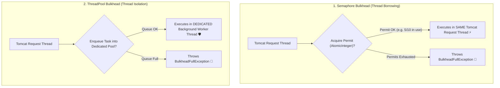

# 20-05: Bulkhead Isolation Architecture: ThreadPool vs Semaphore

> **Module**: `MOD-20: Resilience & Fault Tolerance`
> **Topic ID**: `SB-20-05`
> **Prerequisites**: `SB-20-01`
> **Primary Technology**: Java 21 LTS | Bulkhead Isolation | Thread Pool Partitioning
> **Verification Date**: 2026-09-01

---

## 1. Problem
If Service A calls both a fast Recommendation API (10ms) and a slow Invoice PDF Generator (5000ms), a slowdown in the PDF generator can consume all 200 Tomcat servlet threads. The fast Recommendation API is completely starved of threads and crashes, bringing down the entire application.

---

## 2. Why It Exists: Bulkhead Isolation
Named after watertight compartments in ships that prevent an entire ship from sinking if the hull is breached. In software, Bulkheads partition execution resources so slow dependencies cannot starve unrelated workloads.

---

## 3. Architecture: SemaphoreBulkhead vs ThreadPoolBulkhead



---

## 4. In-Depth Comparison Matrix

| Dimension | `SemaphoreBulkhead` | `ThreadPoolBulkhead` |
|---|:---:|:---:|
| **Execution Thread** | Runs in **Caller's Tomcat Request Thread** | Runs in **Dedicated Background Thread Pool** |
| **Overhead** | **Zero Context Switching** ($O(1)$ Atomic counter) | High (Thread context switching & queueing) |
| **`ThreadLocal` / SecurityContext** | **Preserved Automatically ✅** | Lost (Requires explicit context propagation) |
| **Hard Timeout Preemption** | Cannot cancel running thread | Can cancel/interrupt worker thread |
| **Best For** | Synchronous REST APIs, non-blocking I/O | Slow batch jobs, untrusted blocking I/O |

---

## 5. Production Configuration in `application.yml`
```yaml
resilience4j:
  bulkhead:
    instances:
      reportGenerator:
        maxConcurrentCalls: 5
        maxWaitDuration: 20ms
  thread-pool-bulkhead:
    instances:
      pdfGenerator:
        maxThreadPoolSize: 4
        coreThreadPoolSize: 2
        queueCapacity: 10
```

---

## 6. Common Mistakes
- **Using `ThreadPoolBulkhead` with Virtual Threads**: In Java 21, Virtual Threads are cheap and should not be bounded by heavy fixed thread pools; `SemaphoreBulkhead` is the optimal lightweight isolation primitive for Virtual Threads.

---

## 7. Interview Questions
1. **SDE2**: What is the difference between SemaphoreBulkhead and ThreadPoolBulkhead in Resilience4j?
2. **Senior**: Why is `SemaphoreBulkhead` preferred over `ThreadPoolBulkhead` when running on Java 21 Virtual Threads?

---

## 8. Interview Answer (Senior Level)
"`SemaphoreBulkhead` limits concurrency using an atomic permit counter while executing within the caller's servlet thread, eliminating thread context switching and preserving `ThreadLocal` security/transaction contexts. `ThreadPoolBulkhead` offloads execution to an isolated background thread pool with a bounded queue, enabling hard timeout preemption at the cost of context switching overhead. In Java 21 Virtual Threads, traditional OS thread pool exhaustion is no longer an issue because millions of virtual threads can run concurrently. However, limiting concurrency against downstream saturation is still required: `SemaphoreBulkhead` provides the perfect lightweight, non-blocking permit gate without introducing redundant virtual thread pool layers."
