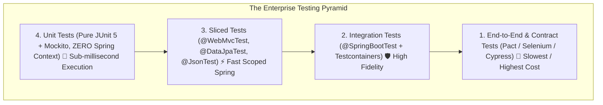

# 21-01: The Testing Pyramid in Spring Boot: Unit vs Slice vs Integration vs E2E

> **Module**: `MOD-21: Testing Spring Applications`
> **Topic ID**: `SB-21-01`
> **Prerequisites**: Spring Boot Fundamentals
> **Primary Technology**: Java 21 LTS | Testing Pyramid | Context Optimization
> **Verification Date**: 2026-09-01

---

## 1. Problem
Testing suites that rely 100% on `@SpringBootTest` (starting the entire Spring container with all database pools and security filters for every test) suffer from multi-minute build times and test fragility (the "Ice Cream Cone" anti-pattern).

---

## 2. The Spring Boot Testing Pyramid

---

## 3. Detailed Architectural Comparison Matrix

| Test Layer | Spring Context Loaded? | Execution Speed | Mocking Strategy | Primary Annotation |
|---|:---:|:---:|---|---|
| **Unit Tests** | **NO (Zero Spring)** | **< 5ms** | Mockito (`@Mock`, `@InjectMocks`) | `@ExtendWith(MockitoExtension.class)` |
| **Slice Tests** | **Partial (10–20% beans)** | **~50–200ms** | `@MockitoBean` / `@MockitoSpyBean` | `@WebMvcTest`, `@DataJpaTest` |
| **Integration Tests** | **Full Context** | **1–5s** | Real DB (Testcontainers) / Mocks | `@SpringBootTest` |
| **Contract Tests** | Full or Sliced | 1–3s | WireMock / Pact Stubs | `@AutoConfigureStubRunner` |

---

## 4. When to Use Which Layer
- **Pure Unit Tests**: Domain calculation algorithms, business rules, utility classes.
- **Slice Tests (`@WebMvcTest`)**: HTTP status codes, request serialization, validation errors (`@Valid`), custom filters.
- **Slice Tests (`@DataJpaTest`)**: Custom JPQL `@Query` methods, database constraints, Spring Data specifications.
- **Integration Tests (`@SpringBootTest`)**: End-to-end user checkout flows spanning controller $\rightarrow$ service $\rightarrow$ database $\rightarrow$ Kafka.

---

## 5. Common Mistakes
- **Using `@SpringBootTest` for testing a single private business calculation**: Spends 3 seconds starting the container to run a 1-millisecond mathematical assert.

---

## 6. Interview Questions
1. **SDE2**: What is the difference between a Unit test and a Slice test in Spring Boot?
2. **Senior**: How do you structure a multi-tier test suite to maintain under-2-minute CI/CD pipeline execution across 2,000 tests?

---

## 7. Interview Answer (Senior Level)
"We adhere strictly to the 70/20/10 pyramid distribution: 70% pure JUnit 5 unit tests with Mockito (zero Spring context, running in under 2 seconds), 20% targeted Spring Test Slices (`@WebMvcTest`, `@DataJpaTest`) that bootstrap only specific layers for controller validation and SQL queries while sharing a cached `ApplicationContext`, and 10% comprehensive integration tests (`@SpringBootTest` with singleton Testcontainers for PostgreSQL and Kafka). This structure guarantees 100% boundary fidelity while keeping total Maven build and verification time well under 2 minutes."
