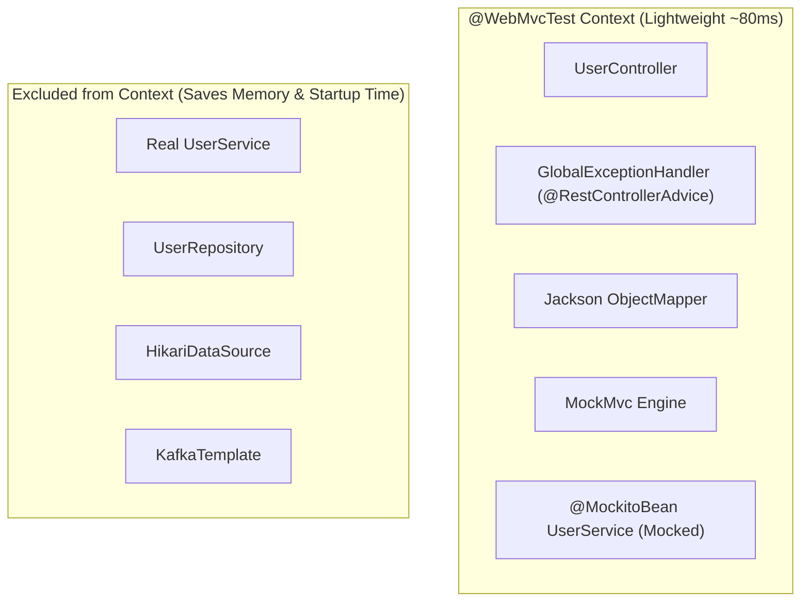

# 21-02: Spring Test Slices: @WebMvcTest, @DataJpaTest, @RestClientTest & @JsonTest

> **Module**: `MOD-21: Testing Spring Applications`
> **Topic ID**: `SB-21-02`
> **Prerequisites**: `SB-21-01`
> **Primary Technology**: Java 21 LTS | Spring Test Slices | Selective Bean Bootstrapping
> **Verification Date**: 2026-09-01

---

## 1. Problem
Testing a REST controller requires `MockMvc`, JSON Jackson converters, and security filters, but does NOT need real database connection pools, JPA entity managers, or Kafka producers.

---

## 2. Why It Exists: Spring Test Slicing
Test slicing annotations bootstrap a **targeted sub-graph of the Spring `ApplicationContext`**, disabling all unrelated auto-configurations:

| Annotation | Bootstraps | Excludes |
|---|---|---|
| **`@WebMvcTest(UserController.class)`** | `@Controller`, `@ControllerAdvice`, `JsonComponent`, `Converter`, `Filter`, `MockMvc` | `@Service`, `@Repository`, `@Component`, DataSource, JPA, Kafka |
| **`@DataJpaTest`** | `@Entity`, `@Repository`, `EntityManager`, Test DataSource, Liquibase/Flyway | `@Controller`, `@Service`, Web infrastructure |
| **`@RestClientTest(MyClient.class)`** | `RestTemplateBuilder`, `RestClient.Builder`, `MockRestServiceServer` | Entire Web MVC and Data layer |
| **`@JsonTest`** | `ObjectMapper`, Jackson modules, `JacksonTester<T>` | All controllers, services, databases |

---

## 3. Architecture: `@WebMvcTest` Scoped Context



---

## 4. Production Example in Java 21: `@WebMvcTest` with `@MockitoBean` (Spring Boot 3.4+)
```java
package com.spring.interview.testing.slice;

import com.spring.interview.testing.controller.UserController;
import com.spring.interview.testing.model.User;
import com.spring.interview.testing.service.UserService;
import org.junit.jupiter.api.DisplayName;
import org.junit.jupiter.api.Test;
import org.springframework.beans.factory.annotation.Autowired;
import org.springframework.boot.test.autoconfigure.web.servlet.WebMvcTest;
import org.springframework.test.context.bean.override.mockito.MockitoBean;
import org.springframework.test.web.servlet.MockMvc;

import java.util.Optional;

import static org.mockito.Mockito.when;
import static org.springframework.test.web.servlet.request.MockMvcRequestBuilders.get;
import static org.springframework.test.web.servlet.result.MockMvcResultMatchers.jsonPath;
import static org.springframework.test.web.servlet.result.MockMvcResultMatchers.status;

@WebMvcTest(UserController.class)
class UserSliceTest {

    @Autowired
    private MockMvc mockMvc;

    // Spring Boot 3.4+ standard MockitoBean replaces legacy deprecated @MockBean
    @MockitoBean
    private UserService userService;

    @Test
    @DisplayName("Should return 200 OK and user JSON on valid ID")
    void shouldReturnUser() throws Exception {
        when(userService.findById("usr-100"))
            .thenReturn(Optional.of(new User("usr-100", "alice", "alice@example.com")));

        mockMvc.perform(get("/api/users/usr-100"))
            .andExpect(status().isOk())
            .andExpect(jsonPath("$.id").value("usr-100"))
            .andExpect(jsonPath("$.username").value("alice"));
    }
}
```

---

## 5. Common Mistakes
- **Using legacy deprecated `@MockBean` in Spring Boot 3.4+**: Spring Boot 3.4 replaces `@MockBean` with `@MockitoBean` from `org.springframework.test.context.bean.override.mockito.MockitoBean`.

---

## 6. Interview Questions
1. **SDE2**: What components are loaded by `@WebMvcTest` versus `@SpringBootTest`?
2. **Senior**: What is new in Spring Boot 3.4 regarding bean mocking in test contexts?

---

## 7. Interview Answer (Senior Level)
"`@WebMvcTest` initializes only the presentation layer (`@Controller`, `@ControllerAdvice`, `MockMvc`, Jackson converters), skipping all service and repository beans to provide sub-100ms test startup. In Spring Boot 3.4, the legacy `@MockBean` and `@SpyBean` annotations were deprecated and replaced by the unified Spring Framework Bean Override API: `@MockitoBean` and `@MockitoSpyBean` located in package `org.springframework.test.context.bean.override.mockito`. This provides clean, extensible lifecycle hooks and uniform caching semantics across all Spring testing slices."
