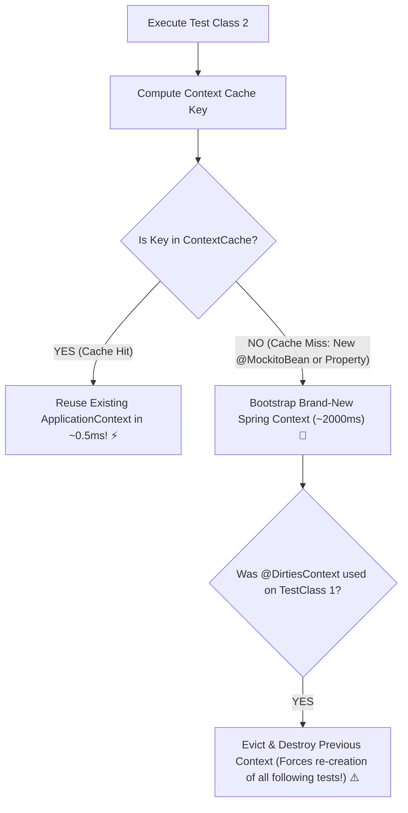

# 21-03: Spring Test Context Caching, @MockitoBean & Context Pollution

> **Module**: `MOD-21: Testing Spring Applications`
> **Topic ID**: `SB-21-03`
> **Prerequisites**: `SB-21-01`, `SB-21-02`
> **Primary Technology**: Java 21 LTS | Test Context Caching | Context Pollution Prevention
> **Verification Date**: 2026-09-01

---

## 1. Problem
Why does running 100 test classes take 3 minutes instead of 10 seconds? Every unique combination of `@MockitoBean`, `@TestPropertySource`, or `@DirtiesContext` forces Spring to discard its cached `ApplicationContext` and create a brand-new container from scratch (Context Cache Miss).

---

## 2. Why It Exists: Spring TestContext Framework Caching
Spring caches `ApplicationContext` instances in a static `ContextCache` (default max size = 32). A cache key is computed from:
- Locations / Configuration classes
- Active Profiles (`@ActiveProfiles`)
- Context Customizers (including the exact set of `@MockitoBean` overrides)
- Property Source descriptors

---

## 3. Architecture: Cache Hit vs Cache Miss & Pollution

---

## 4. Best Practices to Maximize Context Cache Hits
1. **Consolidate `@MockitoBean` declarations**: Place all commonly mocked beans into a shared base test configuration class (`AbstractControllerTest`) so all slice tests share the identical context key.
2. **Avoid `@DirtiesContext` whenever possible**: Prefer resetting mocks (`Mockito.reset()`) in `@BeforeEach` rather than destroying the entire Spring container.
3. **Harmonize `@ActiveProfiles`**: Standardize on `@ActiveProfiles("test")` across all test classes.

---

## 5. Common Mistakes
- **Sprinkling `@DirtiesContext` on every test class**: Turns a 15-second test suite into a 5-minute build slog by forcing Spring to rebuild the container for every single class.

---

## 6. Interview Questions
1. **SDE2**: What causes Spring Test to re-instantiate a new `ApplicationContext` during test execution?
2. **Senior**: How do you detect and optimize Spring Test Context caching in a large monolithic microservice?

---

## 7. Interview Answer (Senior Level)
"Spring caches test `ApplicationContext`s in an in-memory `ContextCache` using a composite key built from configuration classes, active profiles, property sources, and mocked bean descriptors. Whenever a test class introduces a new `@MockitoBean` or different `@TestPropertySource`, the cache key differs, causing a cache miss and forcing Spring to bootstrap a fresh context. We optimize this by creating shared abstract base test classes with standard sets of mocked dependencies, eliminating `@DirtiesContext` in favor of `@BeforeEach` mock resetting, and running Maven tests with `-Dorg.springframework.test.context.cache.maxSize=32` while enabling DEBUG logging on `org.springframework.test.context.cache` to audit cache hit/miss statistics."
