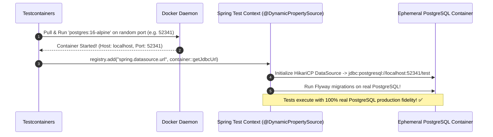

# 21-04: Testcontainers: Real Ephemeral Databases & @DynamicPropertySource

> **Module**: `MOD-21: Testing Spring Applications`
> **Topic ID**: `SB-21-04`
> **Prerequisites**: `SB-11-01`, `SB-21-01`
> **Primary Technology**: Java 21 LTS | Testcontainers 1.20 | Ephemeral Docker Testing
> **Verification Date**: 2026-09-01

---

## 1. Problem
Testing against in-memory H2 databases hides real PostgreSQL/MySQL SQL syntax incompatibilities, dialect mismatches, JSONB query failures, and database lock behaviors.

---

## 2. Why It Exists: Testcontainers Architecture
Testcontainers spins up real, ephemeral Docker containers (PostgreSQL 16, Apache Kafka, Redis) programmatically during the test lifecycle.

---

## 3. Architecture: `@DynamicPropertySource` Runtime Injection

Because Testcontainers binds containers to dynamic random host ports to prevent port collision conflicts in CI/CD, Spring Boot's static `application.properties` cannot hardcode `localhost:5432`.
Spring provides **`@DynamicPropertySource`** to inject dynamic Docker container credentials at runtime:



---

## 4. Production Example in Java 21: Singleton Container Pattern
```java
package com.spring.interview.testing.integration;

import org.springframework.test.context.DynamicPropertyRegistry;
import org.springframework.test.context.DynamicPropertySource;
import org.testcontainers.containers.PostgreSQLContainer;

public abstract class AbstractIntegrationTest {

    // Static singleton container started once across all integration tests
    static final PostgreSQLContainer<?> POSTGRES = new PostgreSQLContainer<>("postgres:16-alpine")
        .withDatabaseName("testdb")
        .withUsername("testuser")
        .withPassword("testpass");

    static {
        POSTGRES.start();
    }

    @DynamicPropertySource
    static void configureDynamicProperties(DynamicPropertyRegistry registry) {
        registry.add("spring.datasource.url", POSTGRES::getJdbcUrl);
        registry.add("spring.datasource.username", POSTGRES::getUsername);
        registry.add("spring.datasource.password", POSTGRES::getPassword);
    }
}
```

---

## 5. Common Mistakes
- **Restarting Testcontainers per test class**: Re-spawning Docker containers per class adds 10+ seconds per class; use the **Static Singleton Container Pattern** (`static { container.start(); }`) to share one container across the entire test run.

---

## 6. Interview Questions
1. **SDE2**: Why is `@DynamicPropertySource` needed when using Testcontainers?
2. **Senior**: How do you structure Testcontainers integration tests to prevent container startup overhead from slowing down CI/CD?

---

## 7. Interview Answer (Senior Level)
"`@DynamicPropertySource` allows tests to dynamically register environment properties (like `spring.datasource.url` or `spring.kafka.bootstrap-servers`) after Testcontainers starts Docker containers on dynamic random ports, avoiding port collisions in parallel CI/CD runners. To prevent container startup overhead, senior architects use the **Singleton Container Pattern**: we define a static container in an abstract base test class and start it in a static initializer block. All integration test classes inherit from this base class, sharing a single persistent Docker container throughout the entire test suite, running Flyway migrations once and dropping/cleaning data between tests in sub-milliseconds."
