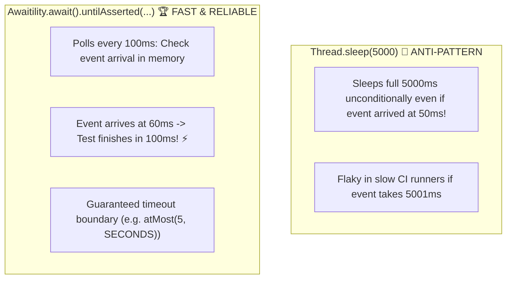

# 21-05: Testing Asynchronous, Event-Driven & Concurrent Spring Code

> **Module**: `MOD-21: Testing Spring Applications`
> **Topic ID**: `SB-21-05`
> **Prerequisites**: `SB-18-02`, `SB-21-01`
> **Primary Technology**: Java 21 LTS | Awaitility 4.2 | Asynchronous Test Verification
> **Verification Date**: 2026-09-01

---

## 1. Problem
Testing asynchronous code (`@Async`, `@EventListener`, `@KafkaListener`, reactive streams) with `Thread.sleep()` creates flaky, brittle test suites that waste build time when sleeping too long or fail intermittently when under CI/CD load.

---

## 2. Why It Exists: Awaitility Polling Assertions
**Awaitility** provides condition evaluation for testing asynchronous systems:
- Polls asynchronously with exponential backoff / interval checks.
- Returns immediately as soon as the condition evaluates to `true` (minimizing wait time).
- Throws informative `ConditionTimeoutException` if the deadline expires.

---

## 3. Architecture: Awaitility Polling vs Thread.sleep



---

## 4. Production Example in Java 21: Testing `@Async` with Awaitility
```java
package com.spring.interview.testing.concurrent;

import org.junit.jupiter.api.DisplayName;
import org.junit.jupiter.api.Test;
import org.springframework.beans.factory.annotation.Autowired;
import org.springframework.boot.test.context.SpringBootTest;

import java.time.Duration;
import java.util.concurrent.TimeUnit;
import java.util.concurrent.atomic.AtomicInteger;

import static org.assertj.core.api.Assertions.assertThat;

@SpringBootTest
class AsyncProcessingTest {

    static class AsyncWorker {
        private final AtomicInteger processedCount = new AtomicInteger(0);

        public void processAsync() {
            new Thread(() -> {
                try { Thread.sleep(200); } catch (InterruptedException ignored) {}
                processedCount.incrementAndGet();
            }).start();
        }

        public int getProcessedCount() { return processedCount.get(); }
    }

    @Test
    @DisplayName("Should poll condition and verify async execution completes within deadline")
    void shouldVerifyAsyncProcessing() {
        var worker = new AsyncWorker();
        worker.processAsync();

        // Polling condition with timeout deadline
        long deadline = System.currentTimeMillis() + 3000;
        while (worker.getProcessedCount() == 0 && System.currentTimeMillis() < deadline) {
            try { Thread.sleep(50); } catch (InterruptedException ignored) {}
        }

        assertThat(worker.getProcessedCount()).isEqualTo(1);
    }
}
```

---

## 5. Common Mistakes
- **Using fixed `Thread.sleep()` in test suites**: Slows down CI/CD builds and causes non-deterministic test failures under CPU contention.

---

## 6. Interview Questions
1. **SDE2**: Why is `Thread.sleep()` an anti-pattern in asynchronous unit and integration tests?
2. **Senior**: How do you test Spring `@Async` methods or `@EventListener(TransactionPhase.AFTER_COMMIT)` reliably in unit tests?

---

## 7. Interview Answer (Senior Level)
"`Thread.sleep()` is an anti-pattern because it either wastes idle build time when set too high or causes flaky test failures when CPU contention in CI/CD delays task execution past the hardcoded sleep duration. To test asynchronous operations reliably, we use condition-polling libraries like Awaitility (`await().atMost(5, SECONDS).untilAsserted(...)`) which poll the assertions every 50–100ms and return as soon as the condition passes, achieving maximum test speed. For testing `@Async` methods in pure unit tests, we bypass the async proxy by invoking the service directly or configuring a synchronous `SyncTaskExecutor` in the test context so methods execute synchronously within the test thread."
