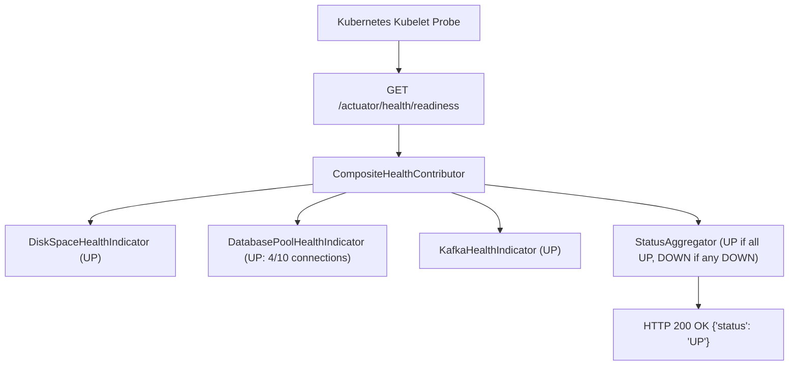

# 22-01: Spring Boot Actuator: Probes, Health Indicators & Security Hardening

> **Module**: `MOD-22: Observability & Production Readiness`
> **Topic ID**: `SB-22-01`
> **Prerequisites**: `SB-05-01`, `SB-15-01`
> **Primary Technology**: Java 21 LTS | Spring Boot Actuator | Production Health Probes
> **Verification Date**: 2026-09-01

---

## 1. Problem
Exposing sensitive Actuator endpoints (`/actuator/env`, `/actuator/heapdump`) publicly can leak production database passwords and API keys, while misconfigured health checks can cause Kubernetes to prematurely kill healthy pods or route user traffic to dead pods.

---

## 2. Why It Exists: Kubernetes Liveness vs Readiness Probes
1. **Liveness Probe (`/actuator/health/liveness`)**: Is the JVM in a broken, unrecoverable state (e.g. fatal deadlock)? If it fails, Kubernetes **restarts the container**.
2. **Readiness Probe (`/actuator/health/readiness`)**: Is the application ready to accept traffic (e.g. caches warmed, Flyway complete, connection pools initialized)? If it fails, Kubernetes **stops sending traffic to the pod** without restarting it.

---

## 3. Architecture: Custom `HealthIndicator` Implementation



---

## 4. Production Example in Java 21: Custom HealthIndicator
```java
package com.spring.interview.observability.health;

import org.springframework.boot.actuate.health.Health;
import org.springframework.boot.actuate.health.HealthIndicator;
import org.springframework.stereotype.Component;

import java.util.concurrent.atomic.AtomicInteger;

@Component
public class DatabasePoolHealthIndicator implements HealthIndicator {

    private final AtomicInteger activeConnections = new AtomicInteger(5);
    private final int maxConnections = 20;

    @Override
    public Health health() {
        int currentActive = activeConnections.get();
        double saturation = (double) currentActive / maxConnections;

        if (saturation >= 0.95) {
            return Health.down()
                .withDetail("activeConnections", currentActive)
                .withDetail("maxConnections", maxConnections)
                .withDetail("reason", "Connection pool exhausted (>95% saturation)")
                .build();
        }

        return Health.up()
            .withDetail("activeConnections", currentActive)
            .withDetail("maxConnections", maxConnections)
            .withDetail("saturationPercentage", (int)(saturation * 100))
            .build();
    }
}
```

---

## 5. Security Hardening Configuration in `application.yml`
```yaml
management:
  endpoints:
    web:
      exposure:
        include: "health,info,prometheus,metrics"  # Exclude env, beans, heapdump
      base-path: /actuator
  endpoint:
    health:
      show-details: when_authorized                # Hide DB credentials from public
      probes:
        enabled: true
```

---

## 6. Common Mistakes
- **Exposing `/actuator/env` or `/actuator/heapdump` without authentication**: Enables attackers to download heap memory dumps containing plaintext cryptographic keys and passwords.

---

## 7. Interview Questions
1. **SDE2**: What is the difference between Kubernetes Liveness and Readiness probes in Spring Boot?
2. **Senior**: Why should database connectivity checks be excluded from Kubernetes Liveness probes?

---

## 8. Interview Answer (Senior Level)
"Liveness checks (`/actuator/health/liveness`) determine if the JVM container is alive; failing a liveness check causes Kubernetes to kill and restart the container. Readiness checks (`/actuator/health/readiness`) determine if the pod can currently serve requests. You must **NEVER include database health in the liveness probe**: if the database experiences a momentary 30-second network glitch, every single application pod's liveness check will fail simultaneously, causing Kubernetes to restart all 50 microservice pods at once (a thundering herd crash loop). Instead, database health belongs strictly in the Readiness probe so pods temporarily stop receiving traffic while the database recovers, without triggering container restarts."
