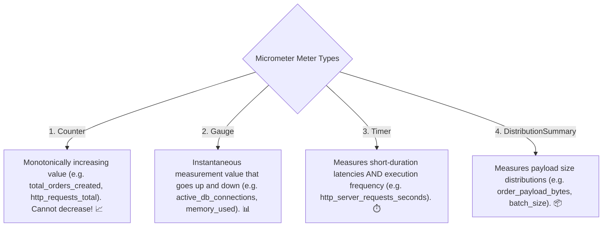

# 22-02: Micrometer & Prometheus: Counters, Gauges, Timers & Histograms

> **Module**: `MOD-22: Observability & Production Readiness`
> **Topic ID**: `SB-22-02`
> **Prerequisites**: `SB-22-01`
> **Primary Technology**: Java 21 LTS | Micrometer 1.14 | Prometheus Dimensional Metrics
> **Verification Date**: 2026-09-01

---

## 1. Problem
Logging text lines to calculate request throughput or latencies produces massive log storage costs and slow query times. How does Micrometer provide dimensional, low-overhead in-memory aggregation of system performance metrics?

---

## 2. The 4 Fundamental Meter Types



---

## 3. Production Example in Java 21: Micrometer Service
```java
package com.spring.interview.observability.metrics;

import io.micrometer.core.instrument.Counter;
import io.micrometer.core.instrument.MeterRegistry;
import io.micrometer.core.instrument.Timer;
import org.springframework.stereotype.Service;

import java.util.concurrent.TimeUnit;

@Service
public class OrderMetricsService {

    private final Counter orderSuccessCounter;
    private final Counter orderFailureCounter;
    private final Timer orderProcessingTimer;

    public OrderMetricsService(MeterRegistry registry) {
        this.orderSuccessCounter = Counter.builder("orders.placed")
            .tag("status", "success")
            .description("Total number of successfully placed orders")
            .register(registry);

        this.orderFailureCounter = Counter.builder("orders.placed")
            .tag("status", "failed")
            .description("Total number of failed order attempts")
            .register(registry);

        this.orderProcessingTimer = Timer.builder("orders.processing.duration")
            .description("Time taken to process and execute order checkout")
            .publishPercentiles(0.5, 0.95, 0.99)
            .register(registry);
    }

    public void recordOrder(boolean success, long durationMillis) {
        if (success) {
            orderSuccessCounter.increment();
        } else {
            orderFailureCounter.increment();
        }
        orderProcessingTimer.record(durationMillis, TimeUnit.MILLISECONDS);
    }

    public double getSuccessCount() { return orderSuccessCounter.count(); }
    public double getFailureCount() { return orderFailureCounter.count(); }
}
```

---

## 4. Common Mistakes
- **Creating unbound high-cardinality tags (e.g. tagging metrics with `userId` or `UUID`)**: Explodes the Prometheus time-series database memory, causing Prometheus crashes.

---

## 5. Interview Questions
1. **SDE2**: What is the difference between a Counter and a Gauge in Micrometer?
2. **Senior**: What is Metric Cardinality Explosion and how do you prevent it in Spring Boot?

---

## 6. Interview Answer (Senior Level)
"A **Counter** is a monotonically increasing value used for event rates (`rate(http_requests_total[5m])`), whereas a **Gauge** tracks an instantaneous snapshot that fluctuates up and down (like connection pool occupancy). **Cardinality Explosion** occurs when dynamic high-cardinality values (such as `user_id`, `email`, or `transaction_uuid`) are used as metric tags. Because Prometheus creates a dedicated time-series stream for every unique combination of key-value tags, millions of unique user IDs create millions of time-series, exhausting Prometheus RAM and slowing query engines. We prevent this by restricting tags strictly to low-cardinality finite enums (e.g. `http_status=200`, `region=us-east-1`, `payment_method=credit_card`)."
