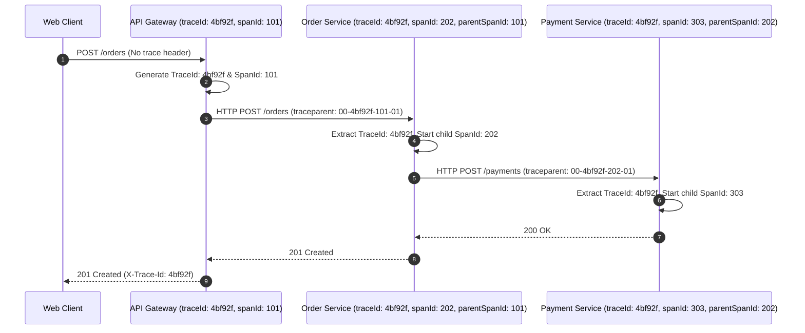

# 22-03: Distributed Tracing: OpenTelemetry, W3C Trace Context & Micrometer Tracing

> **Module**: `MOD-22: Observability & Production Readiness`
> **Topic ID**: `SB-22-03`
> **Prerequisites**: `SB-19-02`, `SB-22-02`
> **Primary Technology**: Java 21 LTS | Distributed Tracing | OpenTelemetry & W3C
> **Verification Date**: 2026-09-01

---

## 1. Problem
When an HTTP request traverses 5 microservices, 2 Kafka topics, and 3 database queries, how do you track the entire distributed execution tree, isolate which specific service introduced 400ms of latency, and correlate all log statements to that single user interaction?

---

## 2. Why It Exists: The W3C Trace Context Standard
Modern distributed tracing adheres to the **W3C `traceparent` header standard**:

$$\text{traceparent: } \underbrace{\text{00}}_{\text{version}}-\underbrace{\text{4bf92f3577b34da6a3ce929d0e0e4736}}_{\text{trace-id (32 hex)}}-\underbrace{\text{00f067aa0ba902b7}}_{\text{parent-span-id (16 hex)}}-\underbrace{\text{01}}_{\text{trace-flags (sampled)}}$$

- **`trace-id`**: Globally unique across the entire distributed request lifecycle.
- **`span-id`**: Unique to each individual unit of work / RPC hop.

---

## 3. Architecture: Distributed Trace Propagation



---

## 4. Micrometer Tracing in Spring Boot 3
In Spring Boot 3, Spring Cloud Sleuth was deprecated in favor of **Micrometer Tracing**:
```yaml
management:
  tracing:
    sampling:
      probability: 1.0   # 100% trace sampling for test/dev; 0.1 (10%) for prod
```

---

## 5. Common Mistakes
- **Losing trace context in multi-threaded `@Async` or `CompletableFuture.supplyAsync()` calls**: Unless using `ContextPropagatingTaskDecorator`, worker threads spawn with empty trace IDs.

---

## 6. Interview Questions
1. **SDE2**: What is the format of the W3C `traceparent` HTTP header?
2. **Senior**: How does Micrometer Tracing propagate distributed trace identifiers across asynchronous thread boundaries in Spring Boot 3?

---

## 7. Interview Answer (Senior Level)
"The W3C `traceparent` header consists of 4 hyphen-separated fields: `version-traceId-parentSpanId-traceFlags`. The `traceId` remains invariant across all services, while each hop creates a new `spanId` with the upstream `spanId` as its parent. In Spring Boot 3, Micrometer Tracing uses `Tracer` and `CurrentTraceContext` to store the active span in a `ThreadLocal`. When crossing asynchronous boundaries (such as `@Async` methods or thread pools), we configure a `TaskDecorator` or `ContextExecutorService` that captures the active `TraceContext` from the invoking thread and attaches it to the worker thread before task execution, ensuring seamless trace correlation in logs."
