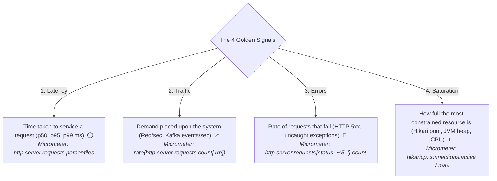
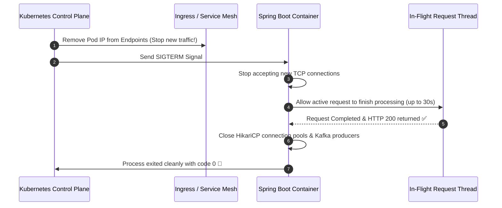

# 22-05: The 4 Golden Signals of SRE & Graceful Shutdown

> **Module**: `MOD-22: Observability & Production Readiness`
> **Topic ID**: `SB-22-05`
> **Prerequisites**: `SB-22-01`, `SB-22-02`
> **Primary Technology**: Java 21 LTS | SRE Golden Signals | Graceful Shutdown Draining
> **Verification Date**: 2026-09-01

---

## 1. Problem
When deploying a new microservice version to Kubernetes, abruptly killing old pods severs in-flight HTTP transactions and drops active Kafka offset commits. How do you monitor production health using Google SRE Golden Signals and execute zero-downtime graceful shutdown?

---

## 2. The 4 Golden Signals of SRE (Google SRE Framework)



---

## 3. Architecture: Graceful Shutdown Connection Draining

When Kubernetes initiates a pod termination (`SIGTERM`):
1. Pod enters `Terminating` state; Kubernetes removes pod from Service endpoints (stops sending new requests).
2. Spring Boot receives `SIGTERM` and initiates **Graceful Shutdown**:
   - Web server stops accepting new connections.
   - Waits up to `spring.lifecycle.timeout-per-shutdown-phase` for in-flight requests to complete.
   - Flushes thread pools and closes database connection pools cleanly.



---

## 4. Production Graceful Shutdown Configuration in `application.yml`
```yaml
server:
  shutdown: graceful

spring:
  lifecycle:
    timeout-per-shutdown-phase: 30s
```

---

## 5. Common Mistakes
- **Omitting `server.shutdown: graceful`**: When a container receives `SIGTERM`, Tomcat terminates worker threads immediately, returning `502 Bad Gateway` / `Connection Reset by Peer` to active clients during rolling updates.

---

## 6. Interview Questions
1. **SDE2**: What are Google SRE's 4 Golden Signals of system monitoring?
2. **Senior**: Walk me through what happens when `server.shutdown: graceful` is triggered during a Kubernetes rolling update.

---

## 7. Interview Answer (Senior Level)
"Google SRE defines the 4 Golden Signals as **Latency** (time to service requests), **Traffic** (system throughput/load), **Errors** (rate of 5xx failures), and **Saturation** (fraction of constrained resources utilized, such as thread pool queue depth or connection pool utilization). When Kubernetes starts a rolling deployment, it removes the pod IP from load-balancer endpoints and sends a `SIGTERM`. With `server.shutdown: graceful`, Spring Boot stops listening on the HTTP port to reject new incoming connections, while granting in-flight requests up to `timeout-per-shutdown-phase` (e.g. 30 seconds) to complete their execution, write responses, and commit database transactions. Once in-flight requests drain to zero, the context closes cleanly without dropping user transactions."
