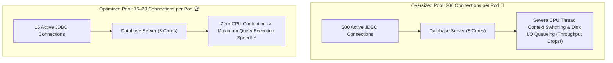

# 23-02: HikariCP Sizing Formula, Pool Physics & Leak Detection

> **Module**: `MOD-23: Performance & Tuning`
> **Topic ID**: `SB-23-02`
> **Prerequisites**: `SB-11-01`, `SB-11-02`
> **Primary Technology**: Java 21 LTS | HikariCP | PostgreSQL Sizing Physics
> **Verification Date**: 2026-09-01

---

## 1. Problem
Engineers often believe that "more database connections = higher throughput" and set `maximum-pool-size: 200`. In reality, this causes severe database CPU context switching, disk I/O thrashing, and connection pool lock contention, degrading total query throughput by 80%!

---

## 2. The PostgreSQL & HikariCP Pool Sizing Formula

The official PostgreSQL and HikariCP hardware connection formula is:

$$\text{Pool Size} = T_N = (\text{Core Count} \times 2) + \text{Effective Spindle Count}$$

- **Core Count**: Number of CPU cores available on the **Database Server** (e.g. 8 cores).
- **Effective Spindle Count**: Number of concurrent disk I/O spindles (for modern SSDs, typically $1$ to $4$).

For an 8-core PostgreSQL database with SSD storage:
$$\text{Pool Size} = (8 \times 2) + 1 = 17 \text{ connections}$$

> [!IMPORTANT]
> **Total DB Connections Across Cluster**: If you run 10 application pods with a pool size of 20 each, the database must support $10 \times 20 = 200$ connections! Ensure the total sum does not exceed PostgreSQL `max_connections`.

---

## 3. Architecture: HikariCP Thread Queueing vs Database Context Switching



---

## 4. Production HikariCP Configuration in `application.yml`
```yaml
spring:
  datasource:
    hikari:
      maximum-pool-size: 15
      minimum-idle: 15                     # Fixed-size pool avoids connection creation spikes
      connection-timeout: 3000ms           # Max time caller waits for connection before exception
      idle-timeout: 600000ms               # 10 minutes
      max-lifetime: 1800000ms              # 30 minutes (Prevents stale network sockets)
      leak-detection-threshold: 5000ms     # Logs stack trace if connection unreturned after 5s!
```

---

## 5. Common Mistakes
- **Setting `minimum-idle` lower than `maximum-pool-size`**: Causes the pool to dynamically open new physical TCP sockets during sudden traffic bursts, adding 100ms connection handshake latency. Set `minimum-idle == maximum-pool-size` for a fixed-size pool.

---

## 6. Interview Questions
1. **SDE2**: What does HikariCP's `leak-detection-threshold` do?
2. **Senior**: Why does increasing the database connection pool size beyond the CPU core formula degrade database performance?

---

## 7. Interview Answer (Senior Level)
"A single CPU core on a database server can execute instructions for only one connection thread at any given instant. When a connection pool is oversized (e.g. 200 connections on an 8-core DB), hundreds of threads contend for CPU execution slices, forcing the OS kernel to spend massive CPU cycles on context switching and cache invalidation rather than executing SQL. The proven HikariCP formula $(\text{CPU cores} \times 2) + \text{spindles}$ ensures that active query threads match the database's hardware capacity, keeping database CPU utilized at peak throughput with zero context switching waste. Additionally, configuring `leak-detection-threshold=5000ms` captures stack traces whenever a developer forgets to close a connection within 5 seconds, preventing silent connection leaks."
