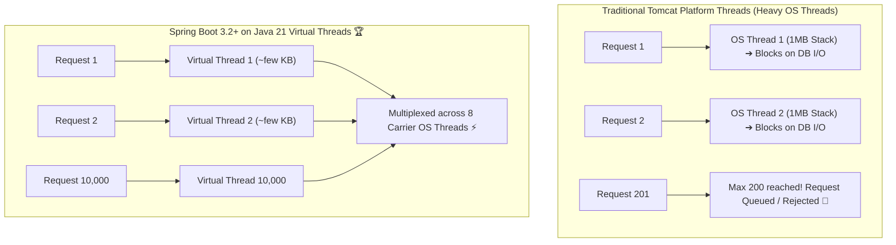

# 23-03: Embedded Tomcat Tuning vs Java 21 Virtual Threads

> **Module**: `MOD-23: Performance & Tuning`
> **Topic ID**: `SB-23-03`
> **Prerequisites**: `SB-08-01`, `SB-23-01`
> **Primary Technology**: Java 21 LTS | Embedded Tomcat | Virtual Threads (Project Loom)
> **Verification Date**: 2026-09-01

---

## 1. Problem
Traditional embedded Tomcat allocates 1 OS platform thread per incoming HTTP request (default `max-threads: 200`). When backend database or third-party API calls take 500ms, 200 concurrent requests exhaust all Tomcat threads, causing `503 Service Unavailable` rejection even if CPU utilization is only 5%!

---

## 2. Platform Threads vs Java 21 Virtual Threads



---

## 3. Comparison Matrix: Tomcat Thread Tuning vs Virtual Threads

| Dimension | Standard Tomcat Thread Pool | Java 21 Virtual Threads (`Loom`) |
|---|:---:|:---:|
| **Concurrency Ceiling** | 200–500 concurrent requests | **10,000–100,000+ concurrent requests 🚀** |
| **Memory per Thread** | ~1MB (Thread Stack) | **~few Kilobytes (Heap-allocated)** |
| **I/O Blocking Behavior** | OS thread blocked on socket read | **Carrier thread unmounted; CPU re-assigned!** |
| **Enabling Configuration** | `server.tomcat.threads.max: 200` | **`spring.threads.virtual.enabled: true`** |
| **Thread Pinning Risk** | None | `synchronized` blocks / native JNI methods |

---

## 4. Enabling Virtual Threads in Spring Boot 3.4+
In `application.yml`:
```yaml
spring:
  threads:
    virtual:
      enabled: true
```
*Effect*: Spring Boot automatically configures Tomcat to spawn a lightweight Virtual Thread for every incoming HTTP request and switches `@Async` task executors to use `Executors.newVirtualThreadPerTaskExecutor()`.

---

## 5. Thread Pinning Caveat
Avoid using `synchronized` blocks around blocking I/O calls (e.g. database calls or HTTP requests), as this **pins the virtual thread to the underlying carrier thread**, preventing it from unmounting. Replace `synchronized` with `java.util.concurrent.locks.ReentrantLock`.

---

## 6. Interview Questions
1. **SDE2**: What happens when `spring.threads.virtual.enabled=true` is set in Spring Boot?
2. **Senior**: What is Thread Pinning in Java 21 Virtual Threads and how do you diagnose it?

---

## 7. Interview Answer (Senior Level)
"Enabling `spring.threads.virtual.enabled=true` replaces Tomcat's standard bounded platform thread pool with an unbounded Virtual Thread executor, creating a new virtual thread per request. When a virtual thread encounters blocking I/O, the JVM unmounts it from the carrier OS thread, allowing the carrier thread to process other requests. **Thread Pinning** occurs when a virtual thread enters a `synchronized` block/method or native JNI call while performing blocking I/O; this locks the carrier thread to the virtual thread, neutralizing unmounting benefits. We diagnose thread pinning using the JVM flag `-Djdk.tracePinnedThreads=full` or Java Flight Recorder (JFR) `jdk.VirtualThreadPinned` events, and refactor the code to use `ReentrantLock` instead of `synchronized`."
