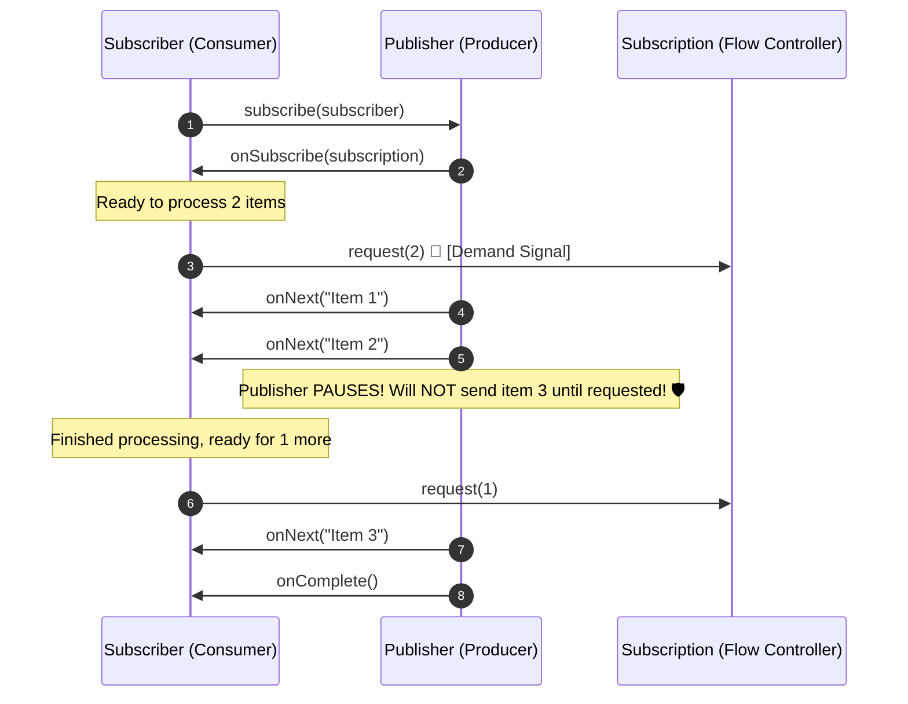

# 24-01: Reactive Streams Specification & The Backpressure Contract

> **Module**: `MOD-24: Reactive Spring with WebFlux`
> **Topic ID**: `SB-24-01`
> **Prerequisites**: Functional Programming Concepts
> **Primary Technology**: Java 21 LTS | Reactive Streams | Non-Blocking Backpressure
> **Verification Date**: 2026-09-01

---

## 1. Problem
When a fast publisher generates 100,000 items/sec but a slow consumer can only process 1,000 items/sec, push-based systems buffer data indefinitely until the consumer process crashes with `OutOfMemoryError: Java heap space`.

---

## 2. Why It Exists: The 4 Reactive Streams Interfaces
The JVM Reactive Streams specification (`java.util.concurrent.Flow`) defines a non-blocking asynchronous push-pull protocol:

1. **`Publisher<T>`**: `subscribe(Subscriber<? super T> s)`
2. **`Subscriber<T>`**: `onSubscribe(Subscription s)`, `onNext(T t)`, `onError(Throwable t)`, `onComplete()`
3. **`Subscription`**: `request(long n)` *(The Backpressure Signal!)*, `cancel()`
4. **`Processor<T, R>`**: Acts as both a Subscriber and a Publisher.

---

## 3. Architecture: The Backpressure Flow Protocol

---

## 4. Backpressure Strategies in Project Reactor
When bridging from legacy push sources (e.g. WebSocket listeners), Project Reactor provides explicit overflow policies:
- **`onBackpressureBuffer()`**: Queues elements up to a bounded size.
- **`onBackpressureDrop()`**: Discards newest incoming items when downstream cannot keep up.
- **`onBackpressureLatest()`**: Keeps only the most recent element, overwriting intermediate drops.
- **`onBackpressureError()`**: Emits an `Exceptions.OverflowException` immediately.

---

## 5. Common Mistakes
- **Assuming reactive streams pull elements synchronously**: Reactive streams are **asynchronous push-pull**: the subscriber *pushes demand* (`request(n)`), and the publisher *pushes data* (`onNext(item)`) without blocking any thread.

---

## 6. Interview Questions
1. **SDE2**: What is Backpressure in the Reactive Streams specification?
2. **Senior**: Walk me through the exact method invocation sequence between Publisher, Subscriber, and Subscription.

---

## 7. Interview Answer (Senior Level)
"Backpressure is a flow-control mechanism where a downstream consumer signals how many data items it is capable of handling, preventing a fast publisher from overwhelming a slow consumer's memory buffer. The protocol begins with `publisher.subscribe(subscriber)`. The publisher instantiates a `Subscription` and returns it via `subscriber.onSubscribe(subscription)`. Crucially, the publisher cannot emit any data until the subscriber explicitly requests demand via `subscription.request(n)`. The publisher then emits up to $n$ items via `onNext(item)` and halts until the subscriber issues another `request(m)` call, concluding with `onComplete()` or `onError(t)`."
