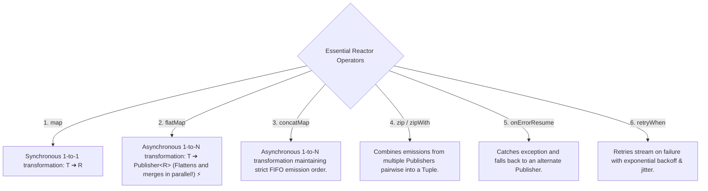

# 24-02: Project Reactor: Mono vs Flux, Operator Pipelines & Schedulers

> **Module**: `MOD-24: Reactive Spring with WebFlux`
> **Topic ID**: `SB-24-02`
> **Prerequisites**: `SB-24-01`
> **Primary Technology**: Java 21 LTS | Project Reactor 3.7 | Functional Operator Pipelines
> **Verification Date**: 2026-09-01

---

## 1. Problem
How do you compose complex asynchronous data transformations (parallel fetching, fallback retries, zip combination) without descending into Callback Hell or blocking OS threads?

---

## 2. Why It Exists: `Mono<T>` vs `Flux<T>`
- **`Mono<T>`**: An asynchronous publisher that emits **0 or 1 item**, followed by `onComplete()` or `onError()` (Analogous to `Optional<CompletableFuture<T>>`).
- **`Flux<T>`**: An asynchronous publisher that emits **0 to $N$ items** (stream sequence), concluding with completion or error.

---

## 3. The 6 Essential Reactor Operators



---

## 4. Schedulers: `publishOn` vs `subscribeOn`
- **`subscribeOn(Schedulers.boundedElastic())`**: Changes the execution thread where the upstream subscription begins (used to isolate legacy blocking I/O calls like JDBC).
- **`publishOn(Schedulers.parallel())`**: Shifts the downstream processing thread for all subsequent operators after the `publishOn` declaration.

---

## 5. Production Example in Java 21: Reactive Pipeline
```java
package com.spring.interview.webflux.service;

import org.springframework.stereotype.Service;
import reactor.core.publisher.Flux;
import reactor.core.publisher.Mono;

import java.time.Duration;

@Service
public class ReactiveProductService {

    public record Product(String id, String name, double price) {}

    public Mono<Product> getProductById(String id) {
        if ("ERR".equals(id)) {
            return Mono.error(new IllegalArgumentException("Invalid product id: " + id));
        }
        return Mono.just(new Product(id, "Product-" + id, 99.99))
            .filter(p -> p.price() > 0)
            .switchIfEmpty(Mono.error(new IllegalStateException("Product not found")));
    }

    public Flux<Product> getAllProducts() {
        return Flux.just(
            new Product("p1", "Laptop", 1200.0),
            new Product("p2", "Mouse", 25.0),
            new Product("p3", "Keyboard", 75.0)
        )
        .map(p -> new Product(p.id(), p.name().toUpperCase(), p.price()));
    }
}
```

---

## 6. Common Mistakes
- **Invoking `.block()` inside reactive pipelines**: Calling `mono.block()` inside a WebFlux Netty event loop thread throws `IllegalStateException: block()/blockFirst()/blockLast() are blocking, which is not supported in thread reactor-http-nio-X` and halts the entire server!

---

## 7. Interview Questions
1. **SDE2**: What is the difference between `map` and `flatMap` in Project Reactor?
2. **Senior**: What is the difference between `publishOn` and `subscribeOn` in a reactive operator pipeline?

---

## 8. Interview Answer (Senior Level)
"`map` performs a synchronous 1-to-1 transformation ($T \rightarrow R$), while `flatMap` transforms each element into an asynchronous publisher ($T \rightarrow \text{Publisher}\langle R\rangle$), flattening and merging emissions concurrently. `subscribeOn` affects the entire upstream chain regardless of where it is declared in the pipeline, shifting the initial subscription and source data generation to a specified `Scheduler` (e.g. `Schedulers.boundedElastic()` for blocking JDBC calls). Conversely, `publishOn` only affects operators *downstream* of its declaration, switching the execution thread context for subsequent transformations."
