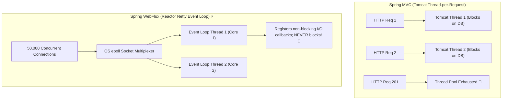

# 24-03: Spring WebFlux Internals: Netty Event Loops vs Servlet Thread-per-Request

> **Module**: `MOD-24: Reactive Spring with WebFlux`
> **Topic ID**: `SB-24-03`
> **Prerequisites**: `SB-08-01`, `SB-24-02`
> **Primary Technology**: Java 21 LTS | Spring WebFlux | Netty Event Loop Architecture
> **Verification Date**: 2026-09-01

---

## 1. Problem
Traditional Spring MVC on Tomcat creates a dedicated 1MB OS stack thread per incoming connection. When 20,000 idle persistent WebSocket / Server-Sent Event (SSE) connections connect simultaneously, Tomcat requires 20GB of RAM just for thread stacks, exhausting server resources.

---

## 2. Why It Exists: Spring WebFlux & Reactor Netty
Spring WebFlux runs on **Reactor Netty non-blocking event loops**. A tiny fixed thread pool (equal to available CPU cores, e.g. 8 threads) handles tens of thousands of concurrent active connections via non-blocking OS I/O multiplexing (`epoll` on Linux, `kqueue` on macOS).

---

## 3. Architecture: Servlet Thread-per-Request vs Netty Event Loop



---

## 4. WebFlux Programming Models
1. **Annotated Controllers**: Uses standard `@RestController`, `@GetMapping`, `@PostMapping` returning `Mono<T>` or `Flux<T>`.
2. **Functional Endpoints (Router Functions)**: Lightweight functional routing via `RouterFunction<ServerResponse>` and `HandlerFunction`.

```java
@Bean
public RouterFunction<ServerResponse> routes(ProductHandler handler) {
    return RouterFunctions.route()
        .GET("/api/products", handler::getAllProducts)
        .GET("/api/products/{id}", handler::getProductById)
        .build();
}
```

---

## 5. Common Mistakes
- **Mixing blocking libraries (e.g. Spring Data JPA / Hibernate) into WebFlux controllers**: Blocks Netty's event loop thread, causing all other requests on that core to hang.

---

## 6. Interview Questions
1. **SDE2**: What is the default embedded web server in Spring WebFlux versus Spring Web MVC?
2. **Senior**: Why is blocking a thread in Spring WebFlux far more dangerous than in Spring Web MVC?

---

## 7. Interview Answer (Senior Level)
"Spring MVC defaults to Apache Tomcat running 200 servlet threads, so blocking a single thread affects only 0.5% of overall server concurrency. Spring WebFlux defaults to Reactor Netty, which allocates a fixed event loop pool of only 1 thread per CPU core (e.g. 8 threads on an 8-core CPU). If a developer executes a blocking JDBC query or `Thread.sleep()` on a WebFlux thread, that entire CPU core's event loop freezes, blocking thousands of concurrent asynchronous requests multiplexed across that single thread and causing catastrophic latency degradation across the entire system."
