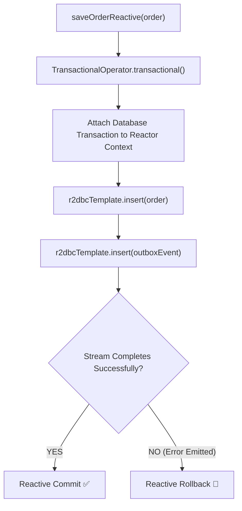

# 24-04: Reactive Data Access: R2DBC vs JDBC & TransactionalOperator

> **Module**: `MOD-24: Reactive Spring with WebFlux`
> **Topic ID**: `SB-24-04`
> **Prerequisites**: `SB-11-01`, `SB-13-01`, `SB-24-02`
> **Primary Technology**: Java 21 LTS | R2DBC | Reactive Transactions
> **Verification Date**: 2026-09-01

---

## 1. Problem
Traditional JDBC (Java Database Connectivity) is inherently synchronous and blocking (`SocketInputStream.read()`). Placing JDBC behind a WebFlux controller forces Netty threads to block on database I/O, negating all reactive benefits.

---

## 2. Why It Exists: R2DBC (Reactive Relational Database Connectivity)
R2DBC is an open, non-blocking standard for SQL database access (PostgreSQL, MySQL, H2) built on Reactive Streams:

| Dimension | JDBC (Spring Data JPA) | R2DBC (Spring Data R2DBC) |
|---|:---:|:---:|
| **I/O Model** | Blocking Socket I/O | **Non-Blocking Asynchronous I/O ⚡** |
| **Return Types** | `List<User>`, `Optional<User>` | `Flux<User>`, `Mono<User>` |
| **Connection Pool** | HikariCP (Blocking) | `r2dbc-pool` (Non-blocking) |
| **Transactions** | `@Transactional` (ThreadLocal bound) | **`TransactionalOperator` (Reactor Context bound)** |
| **ORM Features** | Rich (Lazy loading, Dirty checking) | Lean (Direct SQL mapping, no lazy loading) |

---

## 3. Architecture: Reactive Transactions with `TransactionalOperator`

Because reactive streams switch execution threads across operators (`publishOn`), `ThreadLocal`-based `@Transactional` cannot trace transaction contexts.
Spring Data R2DBC uses **Reactor `Context`** and `TransactionalOperator`:



---

## 4. Production Example in Java 21: `TransactionalOperator`
```java
@Service
public class ReactiveOrderService {

    private final ReactiveOrderRepository orderRepo;
    private final TransactionalOperator txOperator;

    public ReactiveOrderService(ReactiveOrderRepository orderRepo, TransactionalOperator txOperator) {
        this.orderRepo = orderRepo;
        this.txOperator = txOperator;
    }

    public Mono<Order> createOrder(Order order) {
        return orderRepo.save(order)
            .flatMap(saved -> orderRepo.updateAccountBalance(saved.userId(), saved.amount()))
            .as(txOperator::transactional); // Atomic reactive transaction boundary!
    }
}
```

---

## 5. Common Mistakes
- **Using JPA/Hibernate with R2DBC**: JPA relies on blocking reflection and dirty tracking; Spring Data R2DBC is a separate, lean non-blocking SQL abstraction.

---

## 6. Interview Questions
1. **SDE2**: Why can't standard `@Transactional` rely on `ThreadLocal` in reactive WebFlux applications?
2. **Senior**: What are the trade-offs between Spring Data JPA and Spring Data R2DBC in production?

---

## 7. Interview Answer (Senior Level)
"Standard `@Transactional` stores database connections in a `ThreadLocal` (`TransactionSynchronizationManager`). In reactive pipelines, operators like `publishOn` switch execution across different threads, breaking `ThreadLocal` propagation. Spring Data R2DBC resolves this using `TransactionalOperator`, which stores the database connection in the subscriber's immutable **Reactor `Context`**, flowing seamlessly across asynchronous thread hops. While R2DBC delivers true non-blocking SQL streaming and high connection efficiency, it foregoes complex ORM features (like Hibernate lazy loading, 1st-level cache, and complex cascading lifecycles), requiring developers to write explicit SQL queries and projections."
