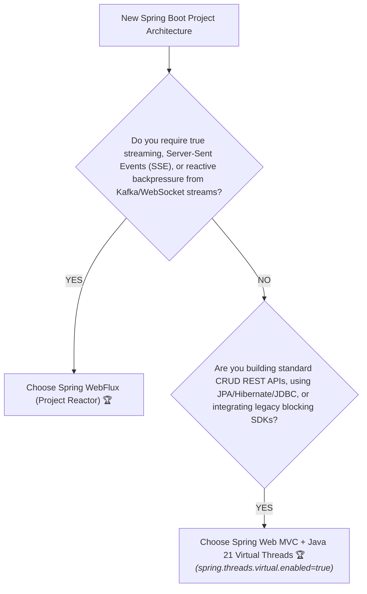

# 24-05: WebFlux vs Virtual Threads: The Architectural Decision Matrix

> **Module**: `MOD-24: Reactive Spring with WebFlux`
> **Topic ID**: `SB-24-05`
> **Prerequisites**: `SB-23-03`, `SB-24-03`
> **Primary Technology**: Java 21 LTS | Virtual Threads vs Reactive WebFlux | Architecture
> **Verification Date**: 2026-09-01

---

## 1. Problem
With the arrival of Java 21 Virtual Threads (Project Loom), should teams still adopt the complex functional programming model of Spring WebFlux, or should they stick to standard Spring MVC with Virtual Threads enabled?

---

## 2. Comprehensive Architectural Comparison Matrix

| Dimension | Spring WebFlux (Project Reactor) | Spring MVC + Virtual Threads (Java 21) |
|---|:---:|:---:|
| **Programming Paradigm** | Functional / Asynchronous Pipeline (`Mono`/`Flux`) | **Imperative / Synchronous (Standard Java)** 🏆 |
| **Concurrency Model** | Non-blocking Event Loops (Netty) | **Virtual Thread-per-Request (Tomcat)** 🏆 |
| **Learning Curve & Debuggability** | **Steep** (Difficult stack traces, Reactor debug agent) | **Zero Learning Curve** (Standard stack traces) 🏆 |
| **Ecosystem Compatibility** | Limited to non-blocking drivers (R2DBC, Redis) | **100% Compatible with entire Java ecosystem (JPA, JDBC)** 🏆 |
| **Streaming / WebSockets** | **Native Backpressure & Event Streaming (`Flux`) 🏆** | Requires manual polling / chunking |
| **Backpressure Support** | **Built-in Reactive Streams Backpressure 🏆** | Thread blocking / Semaphore controls |
| **Memory Footprint** | Ultra-minimal (Few Event Loop threads) | Extremely low (Few KB per Virtual Thread) |

---

## 3. Decision Framework Flowchart

---

## 4. Architectural Summary
- **Choose Spring MVC + Java 21 Virtual Threads (90% of Use Cases)**:
  - Standard enterprise REST CRUD microservices.
  - Teams using Spring Data JPA, Hibernate, JDBC, or blocking third-party SDKs (AWS SDK v1, payment SDKs).
  - Maximizes developer productivity and code readability while achieving 100,000+ concurrent connections.
- **Choose Spring WebFlux (10% of Specialized Use Cases)**:
  - High-volume event gateways and reverse proxies (like Spring Cloud Gateway).
  - Continuous streaming data feeds (live stock quotes, IoT telemetry, real-time sports chat).
  - True end-to-end non-blocking reactive backpressure pipelines.

---

## 5. Common Mistakes
- **Refactoring an entire enterprise JPA application to WebFlux solely for concurrency**: In Java 21, simply toggling `spring.threads.virtual.enabled=true` gives Spring MVC the same high concurrency without breaking JPA, destroying developer productivity, or rewriting thousands of lines of imperative code into reactive pipelines.

---

## 6. Interview Questions
1. **SDE2**: When should you choose Spring WebFlux over Spring MVC in Java 21?
2. **Senior**: How did Java 21 Virtual Threads change the architectural trade-off between Spring MVC and Spring WebFlux?

---

## 7. Interview Answer (Senior Level)
"Prior to Java 21, achieving 50,000+ concurrent connections required Spring WebFlux and Netty event loops to bypass Tomcat's 200-thread OS limit, despite the steep learning curve and lack of JPA support. Java 21 Virtual Threads eliminated this concurrency limitation: Spring MVC can now handle 100,000+ concurrent requests on standard imperative code by simply setting `spring.threads.virtual.enabled=true`. Today, the decision is clear: use **Spring MVC + Virtual Threads** for standard enterprise REST APIs, database transactions, and JPA ecosystems. Reserve **Spring WebFlux** strictly for domain problems requiring continuous data streaming (SSE, WebSockets), event-driven gateways (Spring Cloud Gateway), or explicit reactive backpressure flow control."
