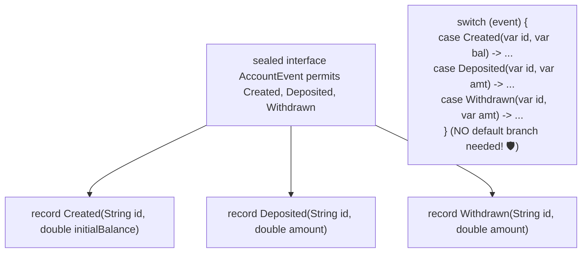

# 25-01: Java 21 LTS in Spring: Records, Pattern Matching & Sealed Types

> **Module**: `MOD-25: Modern Spring`
> **Topic ID**: `SB-25-01`
> **Prerequisites**: Java Core Foundations
> **Primary Technology**: Java 21 LTS | Sealed Types | Pattern Matching for switch
> **Verification Date**: 2026-09-01

---

## 1. Problem
Traditional Java domain models rely on verbose Lombok annotations (`@Getter`, `@Setter`, `@EqualsAndHashCode`), unsafe open class hierarchies where any subclass can break encapsulation, and tedious `instanceof` casting cascades.

---

## 2. Why It Exists: Java 21 LTS Innovations in Spring
1. **Records as Immutable DTOs**: Transparent data carriers providing canonical constructors, accessors, `equals()`, `hashCode()`, and `toString()`. Jackson automatically serializes records with zero reflection hacks.
2. **Sealed Interfaces**: Restricts which classes or records can implement the interface, enabling **Exhaustive Pattern Matching for `switch`**.
3. **Record Patterns**: Deconstructs record components directly in switch statements without casting.

---

## 3. Architecture: Sealed Algebraic Data Types & Exhaustive Switch



---

## 4. Production Example in Java 21
```java
package com.spring.interview.modern.model;

public sealed interface ModernUser permits ModernUser.Admin, ModernUser.Customer, ModernUser.Guest {

    String id();
    String username();

    record Admin(String id, String username, String role, int permissionsLevel) implements ModernUser {}
    record Customer(String id, String username, double accountBalance) implements ModernUser {}
    record Guest(String id, String username, long sessionExpiryEpoch) implements ModernUser {}

    static String formatUserSummary(ModernUser user) {
        // Exhaustive switch pattern matching (compiler verifies all 3 subtypes are covered!)
        return switch (user) {
            case Admin(var id, var name, var role, var lvl) ->
                String.format("Admin '%s' (ID: %s, Role: %s, Level: %d)", name, id, role, lvl);
            case Customer(var id, var name, var bal) ->
                String.format("Customer '%s' (ID: %s, Balance: $%.2f)", name, id, bal);
            case Guest(var id, var name, var exp) ->
                String.format("Guest '%s' (ID: %s, Expiry: %d)", name, id, exp);
        };
    }
}
```

---

## 5. Common Mistakes
- **Using mutable entities as `@ConfigurationProperties` records**: Records are immutable; Spring Boot 3+ binds `@ConfigurationProperties` records via constructor binding cleanly.

---

## 6. Interview Questions
1. **SDE2**: Why are Java Records preferred for Spring Boot Request/Response DTOs over Lombok classes?
2. **Senior**: How do Sealed Interfaces and Pattern Matching for switch eliminate `default` branches and runtime casting errors?

---

## 7. Interview Answer (Senior Level)
"Java Records are shallowly immutable, memory-efficient data carriers with built-in component accessors, canonical constructors, and reliable `equals()`/`hashCode()` contracts, eliminating Lombok annotation processing overhead and preventing accidental state mutation across service layers. When combined with Sealed Interfaces (`permits`), the compiler knows the exhaustive closed set of all permitted subtypes. In Java 21 pattern matching for `switch`, the compiler verifies that every permitted subtype is explicitly handled, eliminating the need for a fallback `default:` clause and converting runtime `ClassCastException` bugs into deterministic compile-time errors."
