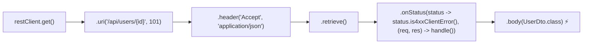

# 25-04: RestClient: The Modern Fluent Synchronous HTTP Client

> **Module**: `MOD-25: Modern Spring`
> **Topic ID**: `SB-25-04`
> **Prerequisites**: `SB-09-01`, `SB-25-03`
> **Primary Technology**: Java 21 LTS | Spring 6.1 RestClient | Fluent HTTP APIs
> **Verification Date**: 2026-09-01

---

## 1. Problem
Legacy `RestTemplate` has over 40 overloaded methods (`getForObject`, `exchange`, `execute`), leading to unreadable, verbose code with complex parameterized type references (`new ParameterizedTypeReference<List<User>>() {}`), while `WebClient` forces teams onto heavy reactive Project Reactor dependencies for simple synchronous requests.

---

## 2. Why It Exists: Spring 6.1 `RestClient`
`RestClient` is a synchronous HTTP client with the intuitive fluent API design of `WebClient`, running on standard blocking I/O and perfectly optimized for **Java 21 Virtual Threads**.

---

## 3. Architecture: Fluent Request Specification Pipeline



---

## 4. Production Example in Java 21: `RestClient` with Custom Error Handling
```java
package com.spring.interview.modern.service;

import org.springframework.http.HttpStatusCode;
import org.springframework.http.MediaType;
import org.springframework.stereotype.Service;
import org.springframework.web.client.RestClient;

import java.util.List;

@Service
public class ExternalUserSyncService {

    public record RemoteUser(String id, String username, String email) {}

    private final RestClient restClient;

    public ExternalUserSyncService(RestClient.Builder builder) {
        this.restClient = builder
            .baseUrl("https://api.example.com")
            .defaultHeader("X-Client-App", "SpringBoot-21")
            .build();
    }

    public RemoteUser fetchUserById(String id) {
        return restClient.get()
            .uri("/v1/users/{id}", id)
            .accept(MediaType.APPLICATION_JSON)
            .retrieve()
            .onStatus(HttpStatusCode::is4xxClientError, (request, response) -> {
                throw new RuntimeException("Remote user not found: " + response.getStatusCode());
            })
            .body(RemoteUser.class);
    }
}
```

---

## 5. Comparison: `RestTemplate` vs `WebClient` vs `RestClient`

| Feature | `RestTemplate` (Legacy) | `WebClient` (Reactive) | `RestClient` (Spring 6.1+) 🏆 |
|---|:---:|:---:|:---:|
| **API Style** | Clunky Overloaded Methods | Fluent Functional | **Fluent Functional 🏆** |
| **I/O Model** | Blocking | Non-blocking (Reactive) | **Blocking (Virtual Thread Friendly) 🏆** |
| **Dependencies** | Core Web | `spring-boot-starter-webflux` | **Core Web (Zero extra deps) 🏆** |
| **Status in Spring** | In Maintenance Mode | Active | **Recommended Default 🏆** |

---

## 6. Interview Questions
1. **SDE2**: What is `RestClient` in Spring 6.1 and why was it introduced?
2. **Senior**: Why is `RestClient` combined with Java 21 Virtual Threads often preferred over `WebClient` for microservice synchronous HTTP calls?

---

## 7. Interview Answer (Senior Level)
"`RestClient` was introduced in Spring Framework 6.1 as the modern synchronous HTTP client offering the fluent, declarative builder syntax of `WebClient` while operating on standard blocking I/O. Legacy `RestTemplate` is in maintenance mode due to its cumbersome API. When paired with Java 21 Virtual Threads (`spring.threads.virtual.enabled=true`), `RestClient` achieves high I/O concurrency without the reactive complexity, thread hopping, and debugging friction of `WebClient` and Project Reactor."
