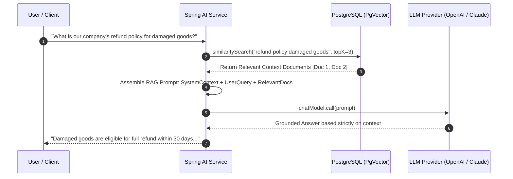

# 25-05: Spring AI Architecture: Models, Prompts, Structured Outputs & PgVector RAG

> **Module**: `MOD-25: Modern Spring`
> **Topic ID**: `SB-25-05`
> **Prerequisites**: Spring Boot Fundamentals
> **Primary Technology**: Java 21 LTS | Spring AI 1.0+ | PgVector & RAG Architecture
> **Verification Date**: 2026-09-01

---

## 1. Problem
Integrating Large Language Models (OpenAI, Anthropic Claude, Ollama, Gemini) into enterprise Java applications without Spring AI requires writing brittle custom HTTP clients, handling token streaming manually, and building custom vector database connectors for Retrieval-Augmented Generation (RAG).

---

## 2. Why It Exists: Spring AI Portable Abstraction Layer
Spring AI brings portable Spring-style abstractions to generative AI:
1. **`ChatModel`**: Portable SPI for executing model calls across OpenAI, Azure OpenAI, Anthropic, Bedrock, and Gemini.
2. **`Prompt` & `PromptTemplate`**: Type-safe parameter substitution and system prompt formatting.
3. **`StructuredOutputConverter` / `BeanOutputConverter<T>`**: Automatically converts LLM raw JSON responses directly into typed Java 21 Records!
4. **`VectorStore` (PgVector, Redis, Milvus, Qdrant)**: Stores embeddings and executes cosine similarity searches.

---

## 3. Architecture: Retrieval-Augmented Generation (RAG) in Spring AI



---

## 4. Production Example in Java 21: Structured Output with Java Records
```java
public record BookSummary(String title, String author, int publicationYear, List<String> mainThemes) {}

@Service
public class AiRecommendationService {

    private final ChatModel chatModel;

    public AiRecommendationService(ChatModel chatModel) {
        this.chatModel = chatModel;
    }

    public BookSummary generateStructuredSummary(String bookTitle) {
        var outputConverter = new BeanOutputConverter<>(BookSummary.class);

        String template = """
            Provide a concise summary for the book {book}.
            {format}
        """;

        PromptTemplate promptTemplate = new PromptTemplate(template);
        promptTemplate.add("book", bookTitle);
        promptTemplate.add("format", outputConverter.getFormat());

        Prompt prompt = promptTemplate.create();
        ChatResponse response = chatModel.call(prompt);

        return outputConverter.convert(response.getResult().getOutput().getContent());
    }
}
```

---

## 5. Common Mistakes
- **Passing unformatted prompts to LLMs and using manual regex to extract JSON**: Use Spring AI's `BeanOutputConverter<T>` which injects schema format instructions and deserializes directly into Java 21 Records.

---

## 6. Interview Questions
1. **SDE2**: What is RAG (Retrieval-Augmented Generation) in Spring AI?
2. **Senior**: How does `BeanOutputConverter` in Spring AI guarantee type-safe JSON deserialization into Java 21 Records?

---

## 7. Interview Answer (Senior Level)
"RAG (Retrieval-Augmented Generation) prevents LLM hallucinations by retrieving authoritative domain documents from a `VectorStore` (like PostgreSQL `pgvector`) using vector embeddings cosine similarity search, and augmenting the system prompt with that retrieved context before sending the query to the `ChatModel`. Spring AI's `BeanOutputConverter<T>` inspects the target Java 21 Record class structure, generates a precise JSON Schema format requirement appended to the prompt, and automatically parses the LLM's returned JSON response into the strongly-typed Record instance, providing seamless type safety without manual string manipulation."
