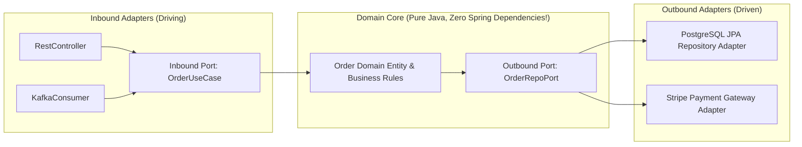

# 26-02: Clean / Hexagonal Architecture: Ports & Adapters in Spring Boot

> **Module**: `MOD-26: Production Architecture`
> **Topic ID**: `SB-26-02`
> **Prerequisites**: Domain-Driven Design (DDD)
> **Primary Technology**: Java 21 LTS | Hexagonal Architecture | Ports & Adapters
> **Verification Date**: 2026-09-01

---

## 1. Problem
Traditional layered architectures (Controller $\rightarrow$ Service $\rightarrow$ Repository) couple core business logic directly to Spring annotations, Hibernate entities, and specific database technologies, making business rules difficult to test and impossible to migrate without massive rewrites.

---

## 2. Why It Exists: Hexagonal / Ports & Adapters Architecture
The Dependency Inversion Principle applied to system architecture:
- **Domain Core (The Hexagon)**: Pure Java domain models, business logic, and invariant rules (ZERO framework annotations!).
- **Inbound Ports (Driver Ports)**: Java interfaces defining what the application can do (`CreateOrderUseCase`).
- **Inbound Adapters**: REST Controllers, Kafka Consumers, CLI commands invoking the Inbound Ports.
- **Outbound Ports (Driven Ports)**: Java interfaces defining what the core needs (`OrderRepositoryPort`, `PaymentGatewayPort`).
- **Outbound Adapters**: Spring Data JPA repositories, Feign clients, Redis caches implementing the Outbound Ports.

---

## 3. Architecture: The Hexagonal Dependency Flow



---

## 4. Package Structure in Modern Spring Boot
```
com.spring.interview.order/
├── domain/                  # Pure Java 21 Domain Entities & Value Objects (No @Entity!)
│   ├── Order.java
│   └── Money.java
├── port/
│   ├── in/                  # Use Case interfaces (Inbound Ports)
│   │   └── PlaceOrderUseCase.java
│   └── out/                 # Infrastructure interfaces (Outbound Ports)
│       └── OrderRepositoryPort.java
└── adapter/
    ├── in/web/              # Spring MVC Controllers (Inbound Adapters)
    │   └── OrderRestController.java
    └── out/persistence/     # Spring Data JPA Entities & Repositories (Outbound Adapters)
        ├── OrderJpaEntity.java
        └── OrderPersistenceAdapter.java
```

---

## 5. Common Mistakes
- **Leaking `@Entity` annotations or JPA relations into the Domain Core**: The domain core should be pure Java with zero framework dependencies.

---

## 6. Interview Questions
1. **SDE2**: What is the difference between an Inbound Port and an Outbound Port in Hexagonal Architecture?
2. **Senior**: How does Hexagonal Architecture decouple domain business logic from database schema evolution?

---

## 7. Interview Answer (Senior Level)
"In Hexagonal Architecture, **Inbound Ports** (Use Cases) define the API boundary for external callers driving the application (e.g. `PlaceOrderUseCase`), implemented by the core domain service. **Outbound Ports** define contracts for external dependencies required by the domain (e.g. `OrderRepositoryPort`), implemented by infrastructure adapters (such as `OrderJpaPersistenceAdapter`). By keeping the domain core in pure Java without `@Entity` annotations or Spring imports, database schemas can be refactored, migrated from PostgreSQL to MongoDB, or tested in pure unit tests in sub-milliseconds without modifying a single line of business invariant logic."
