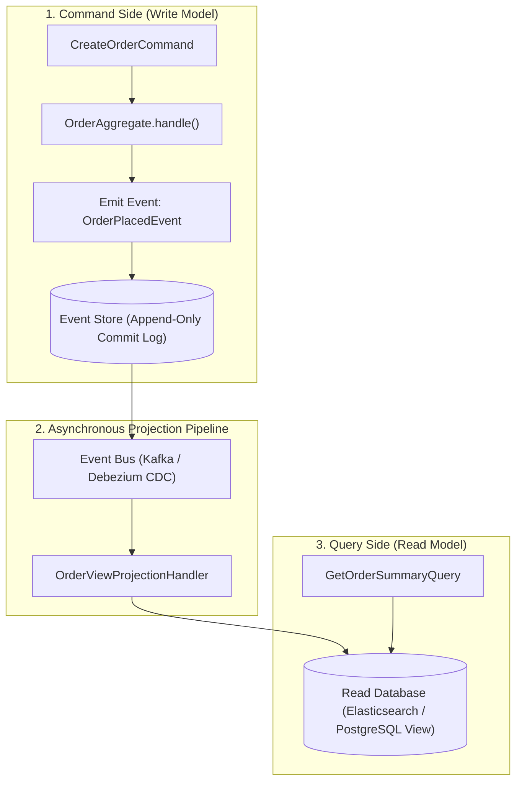

# 26-04: Event Sourcing & CQRS (Command Query Responsibility Segregation)

> **Module**: `MOD-26: Production Architecture`
> **Topic ID**: `SB-26-04`
> **Prerequisites**: `SB-18-05`, `SB-26-02`
> **Primary Technology**: Java 21 LTS | Event Sourcing & CQRS | Immutable Event Logs
> **Verification Date**: 2026-09-01

---

## 1. Problem
Traditional CRUD databases only store current state (e.g. `balance: $500`), completely losing the historical timeline of operations that produced that balance, making forensic auditing and point-in-time state reconstruction impossible.

---

## 2. Why It Exists: Event Sourcing & CQRS Mechanics
- **Event Sourcing**: State is never updated or deleted. Every domain mutation is stored as an **immutable append-only event** (`OrderCreated`, `ItemAdded`, `PaymentAuthorized`). Current state is derived by replaying the event stream.
- **CQRS**: Separates the **Command Model** (Write side: optimized for domain validations and state changes) from the **Query Model** (Read side: denormalized, read-optimized projection views).

---

## 3. Architecture: The CQRS & Event Sourcing Data Flow

---

## 4. Snapshots: Optimizing Event Replay Performance
When an aggregate accumulates thousands of events (e.g. 10,000 transactions on a bank account), replaying all events on every load is slow ($O(N)$).
- **Snapshot Pattern**: Every 100 events, write a state snapshot (`AccountSnapshot(balance: $5000, version: 100)`).
- **Replay**: Load snapshot at version 100 and replay only events $> 100$, achieving $O(1)$ load latency.

---

## 5. Common Mistakes
- **Applying Event Sourcing to simple CRUD applications**: Event sourcing introduces high complexity (event versioning, eventual consistency lag on read side, schema upcasting); use it only where complete audit trails or temporal state queries are mandatory (Banking, Supply Chain).

---

## 6. Interview Questions
1. **SDE2**: What is CQRS and why is it frequently paired with Event Sourcing?
2. **Senior**: How do you handle event schema evolution (Upcasting) when domain event payloads change over time?

---

## 7. Interview Answer (Senior Level)
"CQRS separates the write model from the read model, allowing the write side to focus strictly on domain invariants and append-only event logging, while asynchronous projection handlers stream those events to read-optimized denormalized datastores (like Elasticsearch or Redis). Because events stored in the event log are immutable and can never be deleted or updated in place, when domain event schemas evolve (e.g. adding a mandatory field in `OrderPlacedV2`), we use **Event Upcasters**. An Upcaster is an event transformer pipeline that intercepts historical serialized events on deserialization, converting older V1 payloads into current V2 structures transparently before passing them to the aggregate."
