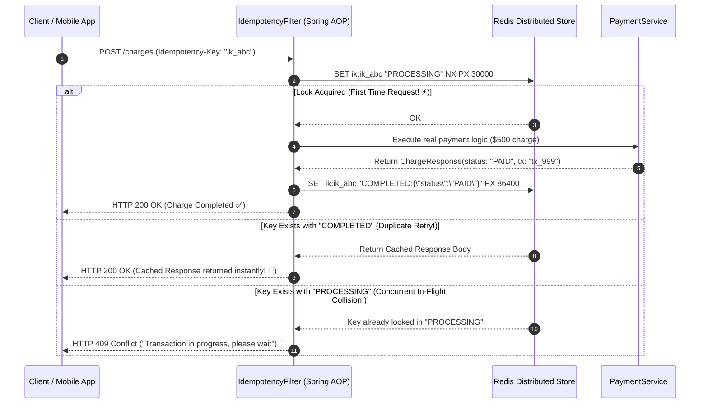

# 26-05: Distributed Idempotency Keys & Advanced Rate Limiting

> **Module**: `MOD-26: Production Architecture`
> **Topic ID**: `SB-26-05`
> **Prerequisites**: `SB-17-05`, `SB-20-04`
> **Primary Technology**: Java 21 LTS | Distributed Idempotency | Redis State Machines
> **Verification Date**: 2026-09-01

---

## 1. Problem
In high-volume payment APIs (e.g. Stripe, Adyen), mobile app retries or network drops cause users to double-click the "Pay \$500" button. How do you guarantee that a request with `Idempotency-Key: ik_12345` executes exactly once, even when two requests arrive within 2 milliseconds across different Kubernetes pods?

---

## 2. Why It Exists: The Distributed Idempotency State Machine
An idempotency store tracks three lifecycle states:
1. **`PROCESSING`**: First thread acquires lock via `SETNX key "PROCESSING" EX 120`.
2. **`COMPLETED`**: Work completes; response payload is cached in Redis (`SET key "COMPLETED:payload" EX 86400`).
3. **`FAILED`**: Operation fails; lock is evicted so the client can retry cleanly.

---

## 3. Architecture: Distributed Idempotency Filter Sequence



---

## 4. Production Example in Java 21: `IdempotencyEngine`
```java
package com.spring.interview.architecture.idempotency;

import org.springframework.stereotype.Component;

import java.time.Duration;
import java.util.Map;
import java.util.concurrent.ConcurrentHashMap;

@Component
public class IdempotencyEngine {

    public enum Status { PROCESSING, COMPLETED }

    public record IdempotencyRecord(Status status, String responsePayload, long expiresAtEpoch) {}

    private final Map<String, IdempotencyRecord> storage = new ConcurrentHashMap<>();

    public synchronized boolean acquireExecutionLock(String key, Duration ttl) {
        cleanExpired();
        IdempotencyRecord existing = storage.get(key);
        if (existing != null) {
            return false; // Already locked or completed
        }
        storage.put(key, new IdempotencyRecord(Status.PROCESSING, null, System.currentTimeMillis() + ttl.toMillis()));
        return true;
    }

    public synchronized void recordCompletion(String key, String responsePayload, Duration retention) {
        storage.put(key, new IdempotencyRecord(Status.COMPLETED, responsePayload, System.currentTimeMillis() + retention.toMillis()));
    }

    public synchronized IdempotencyRecord getRecord(String key) {
        cleanExpired();
        return storage.get(key);
    }

    private void cleanExpired() {
        long now = System.currentTimeMillis();
        storage.entrySet().removeIf(e -> e.getValue().expiresAtEpoch() < now);
    }
}
```

---

## 5. Common Mistakes
- **Caches idempotency keys without expiration (TTL)**: Floods memory with stale keys forever; always attach a reasonable TTL (e.g. 24–48 hours) to completed idempotency records.

---

## 6. Interview Questions
1. **SDE2**: What are the 3 lifecycle states in a distributed idempotency key manager?
2. **Senior**: How do you prevent race conditions when two identical payment requests with the same idempotency key hit separate servers at the exact same millisecond?

---

## 7. Interview Answer (Senior Level)
"When concurrent requests with the same `Idempotency-Key` arrive simultaneously at different server nodes, we use an atomic Redis `SET key PROCESSING NX PX 30000` operation. Only one server node successfully acquires the lock (`OK`), proceeding to execute the payment transaction. The losing node receives `nil`, inspects the current key state, and immediately returns `HTTP 409 Conflict` (or polls Redis until `COMPLETED` is populated). Once the winner finishes, it atomically writes the final HTTP response JSON with a 24-hour TTL, allowing subsequent duplicate requests to return the cached response immediately without hitting downstream payment gateways."
