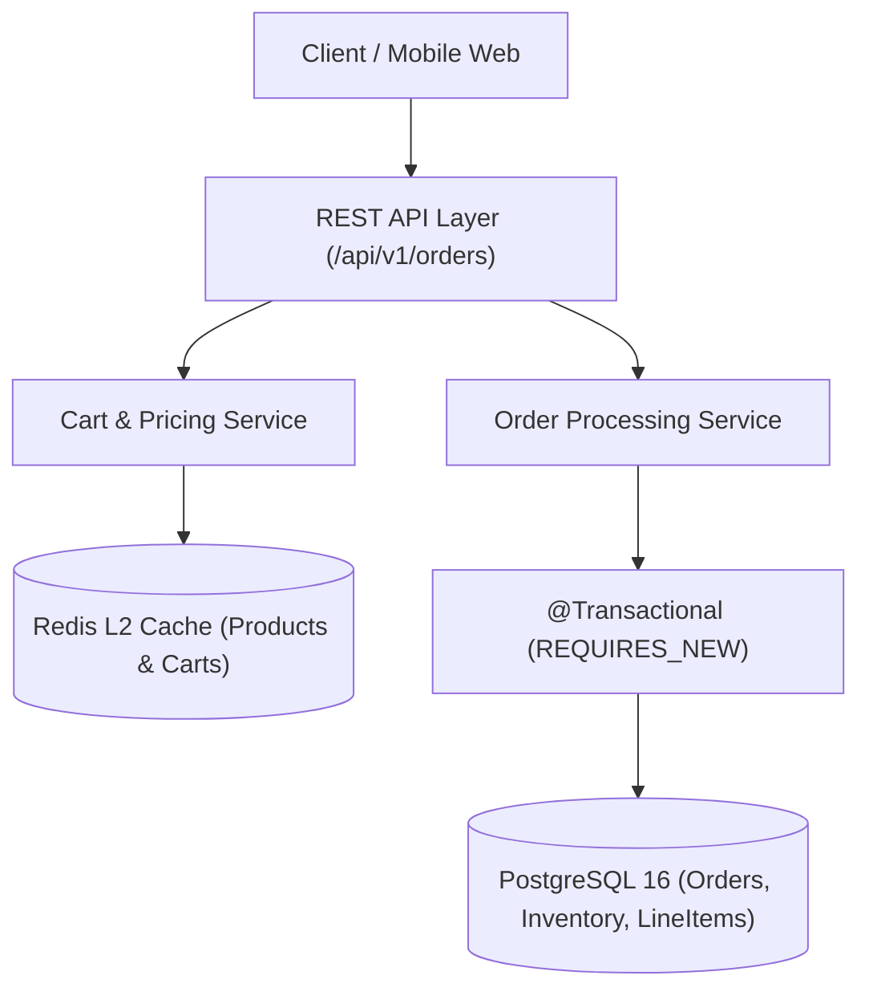

# Project 01: High-Throughput E-Commerce Modular Monolith

> **Project Code**: `PRJ-01`
> **Level**: Senior / SDE2
> **Primary Technology**: Java 21 LTS | Spring Boot 3.4 | Spring Data JPA | PostgreSQL | Redis Cache | HikariCP

---

## 🏗️ Architecture & Domain Model
A modular monolithic e-commerce engine handling product catalog browsing, inventory reservations, shopping cart checkout, and order placement within a single high-performance JVM container.

---

## 🔑 Key Engineering Highlights
1. **Cache-Aside Product Catalog**: Redis caching with `@Cacheable("products")` and random TTL jitter (300s + 0..60s) preventing cache avalanche.
2. **Pessimistic Inventory Locking**: `SELECT * FROM inventory WHERE product_id = :id FOR UPDATE` ensuring zero overselling during flash sales.
3. **Connection Pool Tuning**: HikariCP fixed-size pool configured via the database hardware formula $T_N = (8 \times 2) + 1 = 17$.

---

## 💬 Interview Talking Points
- *Question*: "How do you prevent race conditions when 1,000 users purchase the last 2 items simultaneously?"
- *Answer*: "We acquire a pessimistic write lock in PostgreSQL (`PESSIMISTIC_WRITE`) on the specific inventory row within an ACID transaction. The database serializes updates on that row, checking `stock_quantity >= requested_quantity` and decrementing atomically, immediately rolling back transactions that encounter zero stock."
