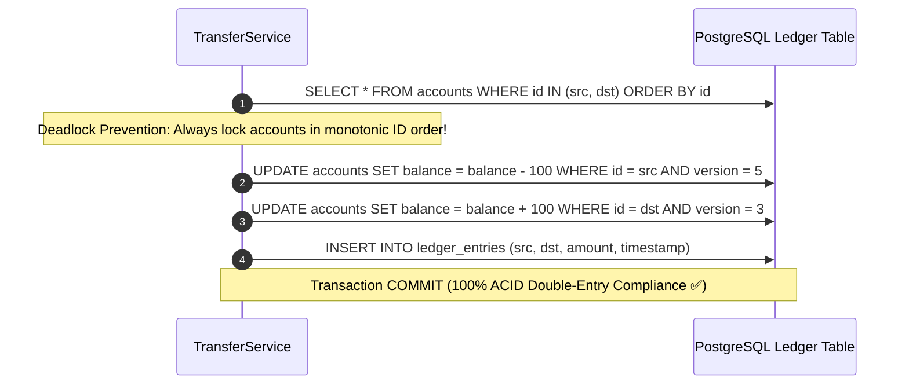

# Project 02: High-Concurreny Banking Transaction Service

> **Project Code**: `PRJ-02`
> **Level**: Senior / Staff
> **Primary Technology**: Java 21 LTS | Spring Data JPA | PostgreSQL Isolation Level SERIALIZABLE | Optimistic Locking

---

## 🏗️ Architecture & Domain Model
A double-entry banking ledger service processing peer-to-peer balance transfers and multi-currency exchange with zero phantom reads or lost updates.

---

## 🔑 Key Engineering Highlights
1. **Deadlock Prevention**: Always sort and acquire account locks in ascending alphabetical/numerical ID order (`min(src, dst)` first).
2. **Optimistic Locking with Retry**: `@Version` column with Resilience4j `@Retry(maxAttempts = 3, backoff = @Backoff(delay = 50))` for high-throughput non-conflicting transfers.
3. **Audit Trail**: Double-entry ledger where debits equal credits in every transaction.

---

## 💬 Interview Talking Points
- *Question*: "How do you guarantee two concurrent inverse transfers (A $\rightarrow$ B and B $\rightarrow$ A) don't trigger database deadlocks?"
- *Answer*: "Deadlocks occur due to cyclic lock dependency: Thread 1 locks A and waits for B, while Thread 2 locks B and waits for A. We enforce a global deterministic locking order: before acquiring database locks, we sort the account IDs and lock the smaller ID first, converting cyclic wait graphs into a strict monotonic hierarchy."
