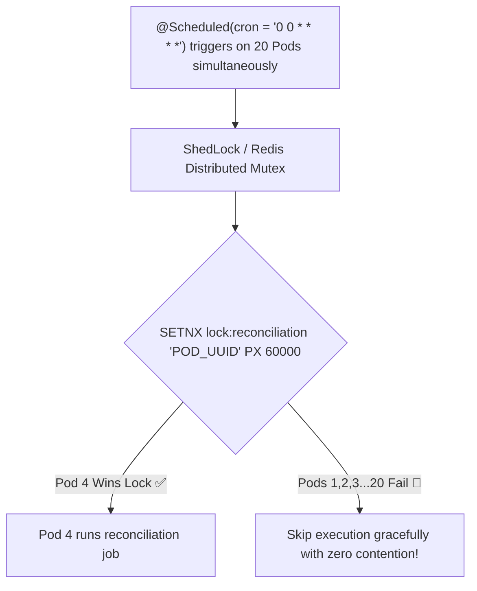

# Project 03: Distributed Task Scheduler & Leader Election

> **Project Code**: `PRJ-03`
> **Level**: Senior / Staff
> **Primary Technology**: Java 21 LTS | Redis Distributed Mutex | ShedLock | Spring Scheduling

---

## 🏗️ Architecture & Domain Model
A clustered background job scheduler executing recurring financial reconciliation and invoice generation cron jobs exactly once across 20 Kubernetes application pods.

---

## 🔑 Key Engineering Highlights
1. **ShedLock Integration**: `lockAtMostFor = "15m"` and `lockAtLeastFor = "30s"` preventing duplicate execution if clocks drift between nodes.
2. **Atomic Lua Release Scripts**: Releasing locks safely by verifying owner token before `DEL`.

---

## 💬 Interview Talking Points
- *Question*: "Why is `@Scheduled` dangerous in a multi-instance Kubernetes deployment?"
- *Answer*: "Standard `@Scheduled` annotations trigger independently inside every JVM container. If 10 pods are running, the cron job executes 10 times in parallel, causing duplicate billing or database corruption. We solve this by wrapping jobs with ShedLock or a Redis distributed mutex lock so only one pod executes the job while all other pods skip execution."
