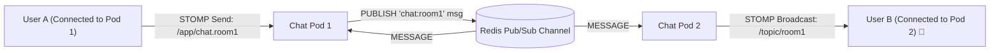

# Project 04: Real-Time Distributed Chat Service (WebSocket & Redis Pub/Sub)

> **Project Code**: `PRJ-04`
> **Level**: Senior / SDE2
> **Primary Technology**: Java 21 LTS | Spring WebSocket STOMP | Redis Pub/Sub | Reactor Netty

---

## 🏗️ Architecture & Domain Model
A horizontally scalable real-time chat application connecting 100,000 concurrent browser WebSocket connections, broadcasting messages across a multi-node cluster using Redis Pub/Sub.

---

## 🔑 Key Engineering Highlights
1. **STOMP over WebSocket**: Full-duplex bidirectional frame protocol with heartbeat detection.
2. **Cross-Pod Message Distribution**: Redis `ReactiveRedisTemplate` Pub/Sub channels distributing messages across all active application pods.

---

## 💬 Interview Talking Points
- *Question*: "How do you route a message from User A connected to Pod 1 to User B connected to Pod 2?"
- *Answer*: "WebSocket TCP connections are stateful and pinned to individual server instances. When Pod 1 receives a message, it publishes the payload to a Redis Pub/Sub channel (`chat:room_id`). All pods subscribe to the Redis channels for their active rooms; Pod 2 receives the Redis event and pushes the message down User B's active WebSocket connection via `SimpMessagingTemplate`."
