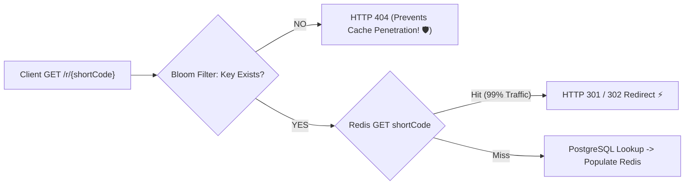

# Project 06: High-Concurrency URL Shortener Service (100k Req/s)

> **Project Code**: `PRJ-06`
> **Level**: Senior / SDE2
> **Primary Technology**: Java 21 LTS | Base62 Encoding | Redis Caching | Bloom Filters | PostgreSQL

---

## 🏗️ Architecture & Domain Model
A distributed URL shortening and redirect engine handling 100,000 redirects/second with sub-5ms latency, backed by Base62 ID encoding, Bloom Filters, and Redis L2 caching.

---

## 🔑 Key Engineering Highlights
1. **Base62 ID Generator**: Base62 (`[0-9a-zA-Z]`) mapping 64-bit integer sequences to 7-character short codes ($62^7 = 3.5 \text{ trillion combinations}$).
2. **Bloom Filter Penetration Shield**: Guava / Redis Bloom filter rejecting non-existent short codes before querying cache or PostgreSQL.
3. **HTTP 301 vs 302 Redirect Semantics**: 301 Permanent (browser caches redirect, saves server bandwidth) vs 302 Temporary (server tracks click analytics).

---

## 💬 Interview Talking Points
- *Question*: "Should a URL shortener use HTTP 301 Permanent or HTTP 302 Temporary Redirects?"
- *Answer*: "HTTP 301 Permanent instructs the browser to cache the target URL, meaning subsequent clicks bypass our server completely—saving massive server bandwidth and compute. However, if our business requires real-time click tracking, geolocation analytics, and referrer metrics, we must use HTTP 302 Found (or 307) so every click hits our server first to increment counters."
