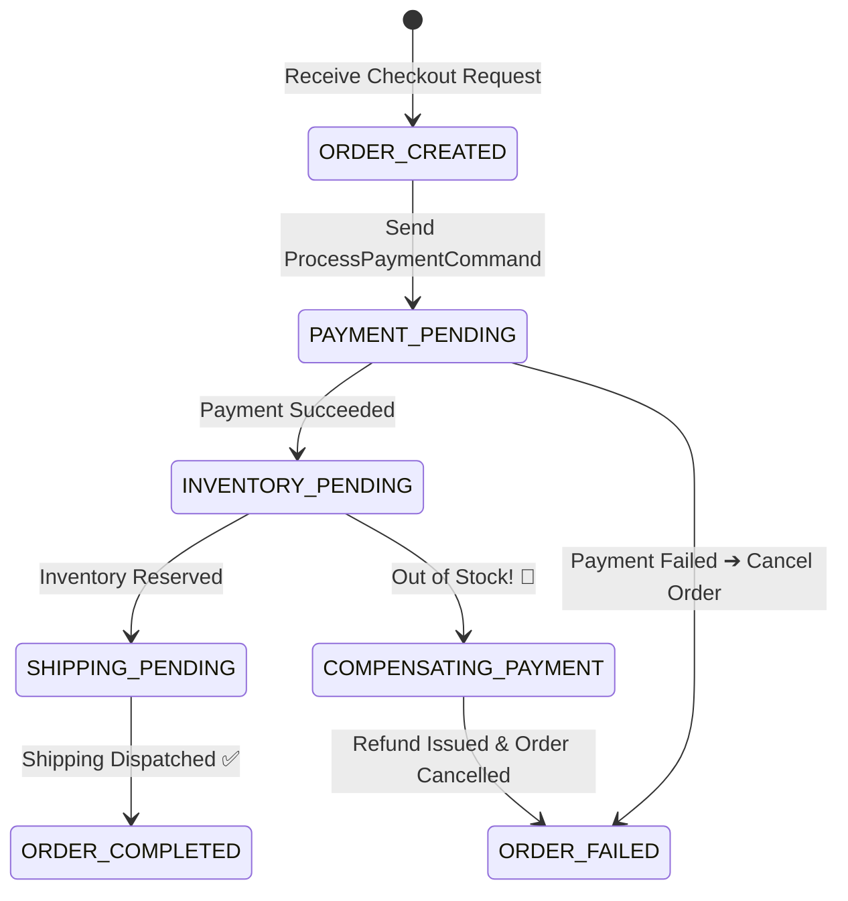

# Project 07: Distributed Order Saga Orchestrator with Compensating Rollbacks

> **Project Code**: `PRJ-07`
> **Level**: Staff / Senior
> **Primary Technology**: Java 21 LTS | Apache Kafka 3.9 | State Machine | Compensating Transactions

---

## 🏗️ Architecture & Domain Model
A state-machine-driven Saga Orchestrator managing multi-step e-commerce checkouts across 4 microservices (Order, Payment, Inventory, Shipping) with automated compensating transactions on failure.

---

## 🔑 Key Engineering Highlights
1. **Saga State Persistence**: Persisting orchestrator state in PostgreSQL before dispatching commands via Kafka.
2. **Compensating Rollback Tree**: Issuing `RefundPaymentCommand` and `ReleaseInventoryCommand` if downstream fulfillment fails.

---

## 💬 Interview Talking Points
- *Question*: "Why is 2-Phase Commit (2PC) rejected in microservices in favor of Sagas?"
- *Answer*: "2PC requires distributed blocking locks across all participants throughout the transaction lifecycle. If any coordinator or participant hangs, database locks remain held, stalling all other user transactions and creating single points of failure. Sagas replace blocking 2PC with a sequence of local ACID transactions and asynchronous compensating actions, providing high throughput and eventual consistency without global locking."
